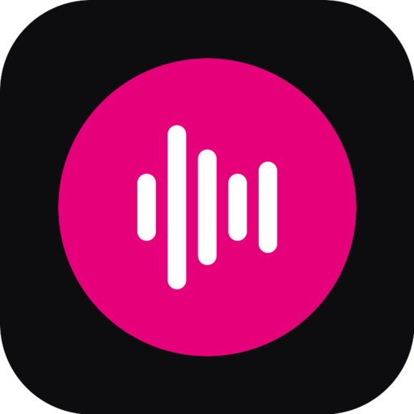
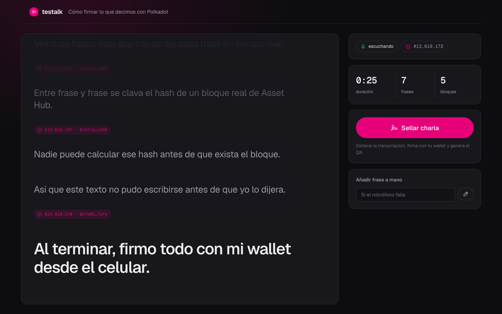
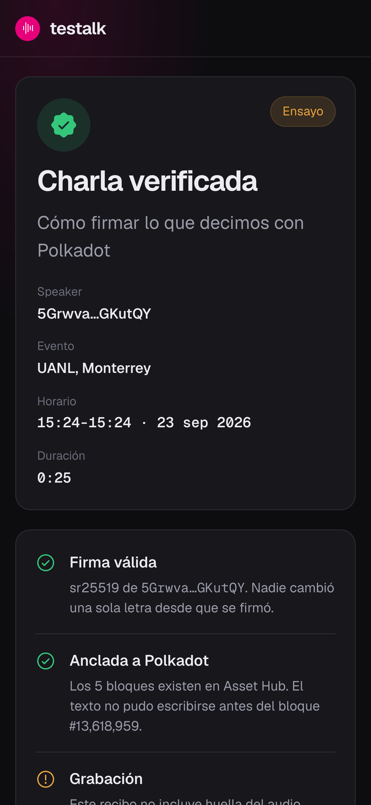
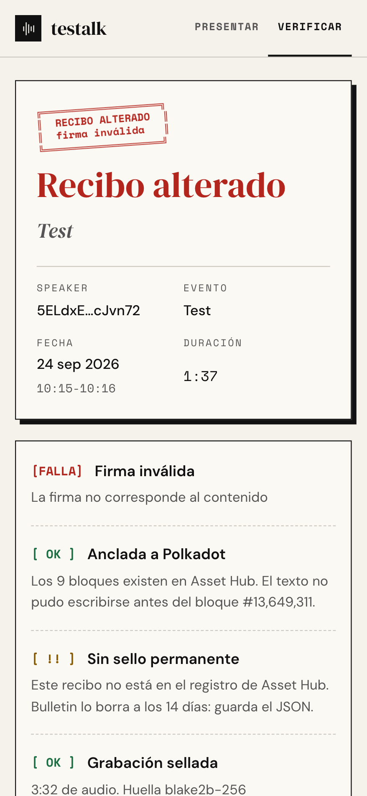
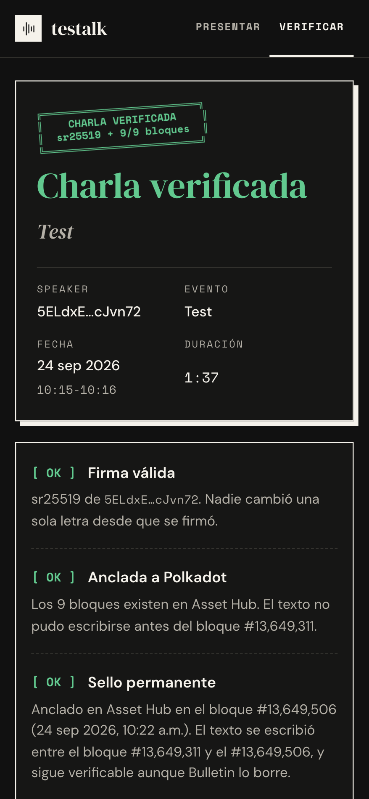
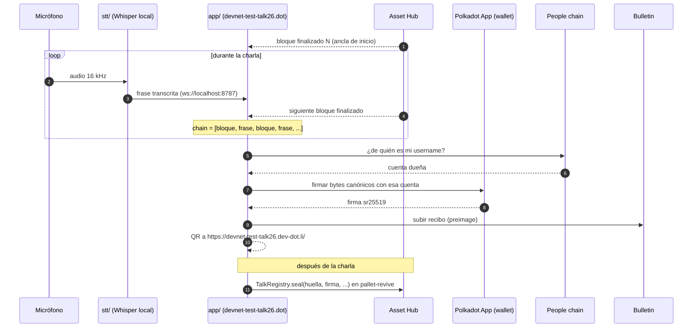

<div align="center">



# testalk

**Lo que dices, firmado y anclado a Polkadot.**

Graba una charla, entrelaza cada frase con block hashes reales de Asset Hub,
fírmala con tu wallet y publica un recibo que cualquiera verifica con un QR.

[](LICENSE)


</div>

<p align="center">
  
</p>

---

## Contenido

- [Qué es](#qué-es)
- [Cómo funciona](#cómo-funciona)
- [Qué prueba y qué no](#qué-prueba-y-qué-no)
- [Basado en Proof of Talk](#basado-en-proof-of-talk)
- [Estructura del repositorio](#estructura-del-repositorio)
- [Inicio rápido](#inicio-rápido)
- [Deploy en Products Devnet](#deploy-en-products-devnet)
- [Estado y roadmap](#estado-y-roadmap)
- [Créditos](#créditos)

## Qué es

En un internet lleno de voces y videos sintéticos, **testalk** hace que la
atribución de una charla sea verificable sin depender de nadie:

1. **Hablas.** Un transcriptor local (Whisper) convierte cada frase en texto.
2. **Se ancla.** Entre frase y frase se inserta el hash de un bloque finalizado de Asset Hub. Nadie puede conocer ese hash antes de que el bloque exista.
3. **Firmas.** Al terminar, firmas el recibo completo con tu wallet de Polkadot App (sr25519).
4. **Cualquiera verifica.** El recibo se sube a Bulletin y aparece un QR. Quien lo escanea con Polkadot App comprueba la firma y consulta cada bloque en la cadena.
5. **Queda para siempre.** La huella y la firma se anclan en `TalkRegistry`, un contrato en pallet-revive. Bulletin borra a los 14 días; el registro no.

Si alguien cambia una sola palabra, la firma deja de ser válida. Si alguien
inventa un bloque, la cadena lo desmiente.

<table>
  <tr>
    <td width="33%"></td>
    <td width="33%"></td>
    <td width="33%"></td>
  </tr>
  <tr>
    <td align="center"><sub>Recibo verificado</sub></td>
    <td align="center"><sub>Una palabra cambiada: firma inválida</sub></td>
    <td align="center"><sub>Modo oscuro</sub></td>
  </tr>
</table>

## Cómo funciona



Detalle de cada pieza en [`docs/architecture.md`](docs/architecture.md) y
especificación del recibo en [`docs/receipt-format.md`](docs/receipt-format.md).

## Qué prueba y qué no

| ✅ Prueba | ❌ No prueba |
|---|---|
| Esta llave firmó **exactamente** este texto | Que la voz sea del firmante: el recibo lleva texto, no audio (para eso está el video de la charla) |
| La llave es la dueña del **username** del recibo en People chain (si se firmó con la identidad `.dot`) | |
| El texto **no existía antes** del primer bloque | Que se haya dicho en vivo |
| El recibo **ya existía** en el bloque en que se ancló en `TalkRegistry` | |
| Cada block hash **existe** en Asset Hub a esa altura | Que el firmante sea una persona única (falta Individuality) |
| | Que lo dicho sea verdad |
| | Cada palabra exacta: es la transcripción de Whisper |

Prueba **atribución**, no veracidad. Modelo de amenazas completo en
[`docs/verification.md`](docs/verification.md).

## Basado en Proof of Talk

testalk replica para el **Polkadot Products Devnet** el modelo
[Proof of Talk](https://code.jedda.eu/proof-of-talk/doc/tip/README.md) que
Karim Jedda presentó en vivo en el Web3 Summit 2026
([charla](https://www.youtube.com/watch?v=7-dSloWKDUU),
[post](https://karimjedda.com/products-for-humans/)).

Mantiene su formato de recibo v1 y su convención de firma: **un recibo de
Proof of Talk se verifica en testalk**, y uno de testalk usa las mismas claves.
Lo que cambia:

| | Proof of Talk | testalk |
|---|---|---|
| Red | Red del Web3 Summit | Products Devnet (Asset Hub `0xd6eec2…`) |
| Bloques | `bestBlocks$` (pueden revertirse en un reorg) | `finalizedBlock$` (no se revierten) |
| Verificador | Solo firma | Firma, cada block hash consultado en la cadena **y** que el username sea dueño de la llave |
| Audio | WAV local, fuera del recibo | No se guarda: el recibo lleva solo texto y la referencia externa es el video de la charla |
| Cierre | Última frase sin bloque posterior | Remache de bloque al sellar |
| Firmante | `getLegacyAccountSigner` del dueño del username | Lo mismo; si el host no lo permite, la cuenta de la app, y el verificador lo dice |
| QR | `polkadotapp://proofoftalk.dot/#/<cid>` | `https://devnet-test-talk26.dev-dot.li/#/<cid>` (abre con la cámara, sin app) |
| Verificación sin app | No | CLI: `npm run verify` |
| Permanencia | Bulletin (14 días) | Registro en pallet-revive: [`TalkRegistry`](contract/) |
| Ensayo | Requiere el host | Modo ensayo en cualquier navegador |

## Estructura del repositorio

```
testalk/
├── app/                        Interfaz web (se publica en devnet-test-talk26.dot)
│   ├── src/
│   │   ├── lib/
│   │   │   ├── artifact.ts     Formato del recibo, firma canónica, CID, verificación
│   │   │   ├── chain.ts        Asset Hub: host provider o WebSocket público
│   │   │   ├── network.ts      Genesis, RPCs y gateway del devnet
│   │   │   ├── signer.ts       Firma con la identidad .dot, la cuenta de la app o la de ensayo
│   │   │   ├── people.ts       People chain: dueño de un username
│   │   │   ├── bulletin.ts     Cuota, permiso PreimageSubmit, subida y lectura
│   │   │   ├── permissions.ts  Permisos de red del contenedor, al arrancar
│   │   │   ├── stt.ts          Cliente WebSocket del transcriptor
│   │   │   ├── mic.ts          Micrófono de la app: detector de voz y Whisper
│   │   │   ├── whisper.worker.ts  Whisper en un hilo aparte (la interfaz no se congela)
│   │   │   ├── host.ts         waitForHost + timeouts para toda llamada al host
│   │   │   └── ascii.ts        Onda de voz, sello y barras en ASCII
│   │   ├── views/              Inicio, presentador, verificador y diagnóstico
│   │   └── style.css           Sistema visual (claro y oscuro)
│   ├── scripts/
│   │   ├── verify.ts           Verificador por línea de comandos
│   │   └── icon.ts             Genera el ícono, el favicon y la marca (npm run icon)
│   ├── brand/                  Ícono en SVG, favicon y marca de la barra superior
│   ├── icon.png                Ícono de la app (manifest de DotNS)
│   └── polkadot-app-deploy.config.ts
├── contract/                   TalkRegistry: Solidity → PolkaVM (resolc) en pallet-revive
│   ├── contracts/TalkRegistry.sol
│   ├── scripts/                deploy · anchor · check, con simulación previa
│   ├── test/                   Pruebas de lógica en EVM local
│   └── deployments.json        Dirección desplegada
├── stt/                        Transcriptor local (Python)
│   ├── testalk_stt.py          Micrófono → VAD → faster-whisper → WebSocket
│   └── guion-demo.txt          Guion para ensayar sin micrófono
├── examples/                   Recibos de ejemplo (válido y alterado)
└── docs/                       Arquitectura, formato, verificación, deploy, guía para estudiantes y revisión de plataforma
```

## Inicio rápido

Requisitos: Node 22.18+ (el CLI usa type stripping nativo) y Python 3.10+.

### 1. La app en modo ensayo

```bash
cd app
npm install
npm run dev
```

Fuera de Polkadot App la app entra en **modo ensayo**: firma con la cuenta de
desarrollo `//Alice`, no sube a Bulletin y marca el recibo como ensayo. Sirve
para probar todo el flujo en cualquier navegador.

### 2. El transcriptor

```bash
cd stt
python3 -m venv .venv
.venv/bin/pip install -r requirements.txt

.venv/bin/python testalk_stt.py --demo guion-demo.txt          # sin micrófono
.venv/bin/python testalk_stt.py --language es --model small    # micrófono real
.venv/bin/python testalk_stt.py --list-mics                    # elegir micrófono
```

El modo `--demo` solo necesita `websockets`. La primera corrida con micrófono
descarga el modelo de Whisper (~480 MB para `small`). Las frases quedan en
`stt/grabaciones/*.jsonl`; el audio no se guarda salvo con `--guardar-audio`
(copia local, no entra al recibo).

### 3. Anclar un recibo para siempre

```bash
cd contract
npm install
npm run sign   -- ~/Descargas/testalk-xxxx.json   # solo si es de ensayo o la app no pudo firmar
npm run anchor -- ~/Descargas/testalk-xxxx.json   # pide semilla; firma solo si escribes SELLAR
npm run check  -- ~/Descargas/testalk-xxxx.json   # ¿está sellado?
```

`TalkRegistry` vive en [`0xf4acbd6ae6f57ec2b117d4a0b9bb18026496b40a`](contract/deployments.json).
Detalles en [`contract/README.md`](contract/README.md).

### 4. Verificar sin la app

```bash
cd app
npm run verify -- ../examples/rehearsal-uanl.json   # ✓ CHARLA VERIFICADA (exit 0)
npm run verify -- ../examples/tampered-uanl.json    # ✗ RECIBO NO VÁLIDO  (exit 1)
npm run verify -- <CID>                             # lee del gateway IPFS del devnet
```

Para verificar el recibo original de Karim:

```bash
curl -sL https://blog.jedda.eu/bafybeiaagh44lqgz64g5ccnde454yxeqgrspl32klxafdfrj3jz55ag35i/artifact.json -o /tmp/pot.json
npm run verify -- /tmp/pot.json   # firma válida; bloques de otra red, sin comprobar
```

## Deploy en Products Devnet

> **¿Primera vez publicando una app `.dot`?** La [guía para estudiantes](docs/products-devnet-guide.md) explica todo el proceso desde cero, con los errores reales y cómo salir de ellos.

```bash
cd app
pad login          # una vez: QR con Polkadot App
npm run deploy     # build + PAD_ENV=devnet pad dist devnet-test-talk26.dot
```

Ejecútalo en una terminal propia: `pad` pide confirmaciones interactivas.

Después abre **`devnet-test-talk26.dot/#/diagnostico`** en Polkadot Desktop y en el
celular. Prueba cada pieza de la plataforma desde el dispositivo (canal con el
host, permisos de red, micrófono, WebGPU, bloques, consulta histórica,
transcriptor, firma y Bulletin) y deja un reporte copiable.
Guía completa, reglas de dominios DotNS y checklist para el día del evento en
[`docs/deploy.md`](docs/deploy.md).

## Estado y roadmap

Caso de ejemplo para el piloto **Polkadot University**, UANL Monterrey,
29 a 31 de octubre de 2026.

- [x] Transcripción en vivo con bloques finalizados entrelazados
- [x] Firma sr25519 con formato compatible con Proof of Talk v1
- [x] Verificador web y CLI con comprobación on-chain de bloques
- [x] Recibo solo con texto: sin audio ni huella del WAV (25 sep 2026). La charla se graba en video y esa es la referencia externa
- [x] Flujo completo probado en modo ensayo contra el devnet real
- [x] Código alineado con el comportamiento medido del devnet ([detalle](docs/deploy.md#comportamiento-conocido-del-devnet))
- [ ] Prueba en Polkadot Desktop y celular: firma de bytes con `SignerManager`, subida a Bulletin y acceso a `localhost`
- [x] Corregir en código los hallazgos de la [revisión del 25 sep 2026](docs/platform-review-2026-09-25.md) contra TWR.DOT y la documentación de PCF; los que dependen del dispositivo se miden con `#/diagnostico`
- [x] `TalkRegistry` desplegado en pallet-revive: huella, firma y cota superior de tiempo, permanentes
- [x] Verificador web y CLI consultan el registro
- [ ] Anclar desde la app al sellar (hoy se ancla con `npm run anchor` después de la charla)
- [x] Verificar en People chain que el username declarado sea dueño de la llave (web y CLI)
- [x] Firmar con la identidad `.dot` (username → People chain → cuenta dueña), con la cuenta de la app de respaldo
- [ ] Confirmar en Polkadot Desktop que el host firma con la identidad (`signRawWithLegacyAccount`): lo mide `#/diagnostico`
- [x] Grabar y transcribir **dentro de la app**, sin el script de Python: micrófono del contenedor + Whisper base en un Web Worker (WebGPU o WebAssembly), con botón y tecla **M** para encender o apagar el micrófono
- [ ] Probar el micrófono de la app en una charla real en Polkadot Desktop
- [ ] Charla de prueba de 15 minutos, sellada de principio a fin

## Créditos

- Modelo original, formato de recibo y convención de firma: **Proof of Talk** de
  [Karim Jedda](https://karimjedda.com). testalk reimplementa ese diseño para
  otra red y lo extiende.
- Transcripción: [faster-whisper](https://github.com/SYSTRAN/faster-whisper).
- Plataforma: Polkadot App, Bulletin, DotNS y `pad` de la Polkadot Community Foundation.
- Íconos: [Phosphor](https://phosphoricons.com). Tipografía: DM Serif Display, DM Sans y Space Mono.
- Lenguaje visual: el mismo del sitio de Polkadot México (papel crema, tinta, sombras duras, dither y acentos ASCII).

## Licencia

[MIT](LICENSE)
