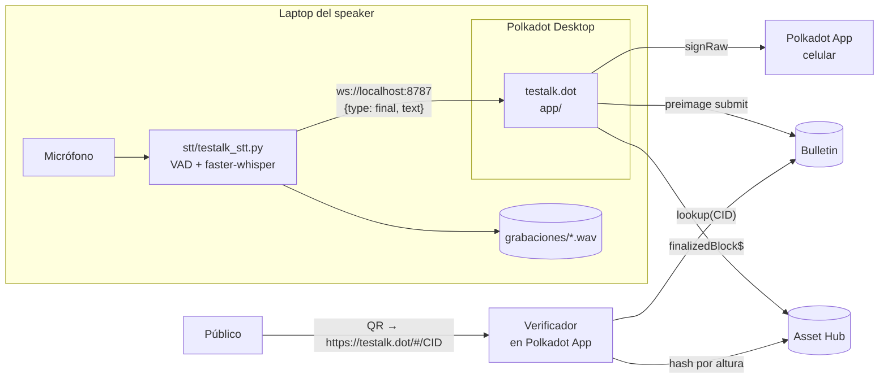

# Arquitectura

testalk tiene dos procesos que corren en la laptop del speaker y una red de
destino.

## Componentes

### `stt/` Transcriptor local

Python, fuera del navegador, por dos razones: Whisper necesita CPU y memoria
que un webview no garantiza, y el audio debe guardarse aunque la app falle.

| Etapa | Detalle |
|---|---|
| Captura | `sounddevice`, 16 kHz mono, tramas de 30 ms |
| Segmentación | `webrtcvad`: abre frase tras ~90 ms de voz, la cierra tras ~510 ms de silencio, tope de 12 s |
| Transcripción | `faster-whisper`, `beam_size=1`, un solo worker para que la latencia no se acumule |
| Salida | Cada frase terminada va a los clientes WebSocket y a un JSONL |
| Grabación | WAV PCM16 siempre, con flush cada ~3 s |
| Sellado | Al recibir `{"type":"seal"}` cierra el WAV y responde `{"type":"audio","hash","bytes","seconds"}` |

El modo `--demo <archivo>` emite una línea cada ~4 s sin micrófono ni modelo.

### `app/` Interfaz web

TypeScript sin framework, empaquetado con Vite. Tres vistas con rutas por hash
(`#/`, `#/presentar`, `#/verificar`, `#/<CID>`): la app se sirve desde su content
hash en Bulletin y las rutas profundas no tienen fallback a `index.html`.

| Módulo | Responsabilidad |
|---|---|
| `lib/host.ts` | `waitForHost()` espera el canal `connected` y `withTimeout()` pone tope a toda llamada al host. Sin esto, una llamada encolada nunca resuelve ni lanza error. |
| `lib/chain.ts` | Cliente de `polkadot-api`: `getHostProvider(genesis)` dentro del contenedor, WebSocket público fuera. Suscripción a bloques finalizados y consulta de hash por altura. |
| `lib/signer.ts` | `SignerManager` en el host; cuenta `//Alice` en modo ensayo. |
| `lib/bulletin.ts` | `BulletinAllowance` → permiso `PreimageSubmit` → `submit()`. Lectura con `lookup()`. |
| `lib/artifact.ts` | Tipos del recibo, bytes canónicos, CID, verificación de firma y de bloques. Es el único módulo que comparten la app y el CLI. |
| `lib/stt.ts` | Cliente WebSocket del transcriptor con reconexión y petición de sellado. |

## Flujo del presentador

1. **Preparación.** Título, evento e idioma. Se conecta la wallet y se muestran tres comprobaciones en vivo: wallet, transcriptor y Asset Hub. No se puede empezar sin un bloque: es el ancla de inicio.
2. **En vivo.** Cada frase entra al `chain`. El primer bloque finalizado que llega **después** de una frase se inserta como remache. Los silencios no generan bloques, así el recibo no se infla.
3. **Sellado.**
   1. Se pide al transcriptor la huella del WAV (8 s de tope; si no contesta se sella sin audio).
   2. Si quedaron frases sin bloque posterior, se agrega el último bloque finalizado como remache de cierre.
   3. Se construye el recibo, se calculan los bytes canónicos y se firman.
   4. Se sube a Bulletin y se genera el QR.
4. **Recuperación.** El `chain` se guarda en `localStorage` en cada cambio. Si la página se recarga antes de sellar, la preparación ofrece recuperar la charla.

## Decisiones

| Decisión | Por qué |
|---|---|
| Bloques finalizados en vez de `best` | Un bloque best puede quedar huérfano en un reorg; su hash dejaría de existir y el verificador marcaría el recibo como falso. Finalizar tarda unos segundos más en Asset Hub. |
| `SignerManager` en vez de `getLegacyAccountSigner` | En el Products Devnet el signer del accounts provider no abre la hoja de firma y la llamada se queda colgada. |
| QR con `https://testalk.dot/...` | Es el único deep link que el host enruta dentro del contenedor. Esquemas propios o gateways web abren fuera y ahí no hay host. |
| Transcriptor en Python y no en el navegador | Rendimiento de Whisper y garantía de grabación. Coincide con la arquitectura probada en escenario por Proof of Talk. |
| Formato v1 intacto y campos nuevos aparte | Compatibilidad con los verificadores de Proof of Talk. Los campos nuevos quedan cubiertos por la firma. |
| Fuentes e íconos dentro del bundle | El contenedor no garantiza acceso a CDNs; la fuente de íconos completa pesaría varios MB en Bulletin, así que solo se importan los SVG usados. |

## Red

| Parámetro | Valor |
|---|---|
| Asset Hub genesis | `0xd6eec26135305a8ad257a20d003357284c8aa03d0bdb2b357ab0a22371e11ef2` |
| RPC públicos | `wss://asset-hub-paseo-rpc.n.dwellir.com`, `wss://sys.turboflakes.io/asset-hub-paseo` |
| Gateway IPFS | `https://devnet-ipfs.api.polkadotcommunity.foundation/ipfs/<CID>` |

Todo vive en [`app/src/lib/network.ts`](../app/src/lib/network.ts).
