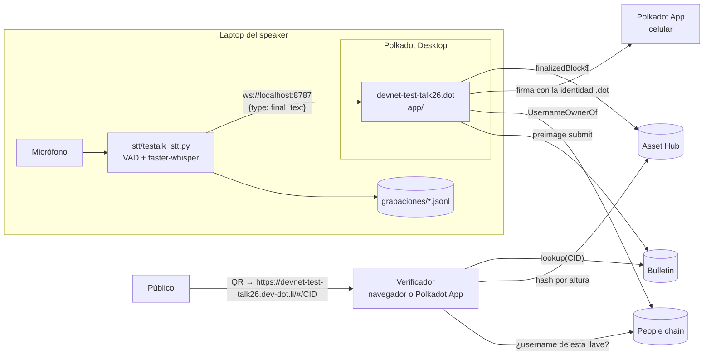

# Arquitectura

testalk tiene dos procesos que corren en la laptop del speaker y una red de
destino.

## Componentes

### Dos formas de transcribir

| | Script de Python (`stt/`) | Micrófono de la app (`lib/mic.ts`) |
|---|---|---|
| Qué instalar | Python 3.10+ y `faster-whisper` | Nada: se baja Whisper la primera vez (~80-200 MB) |
| Modelo | `small` (mejor en español) | `base` |
| Dónde corre | CPU de la laptop | El navegador de Polkadot Desktop (WebGPU si hay) |
| Audio | No se guarda (con `--guardar-audio`, copia local) | No se guarda |
| Cuándo usarlo | Charlas largas o jerga técnica | Probar rápido, o cuando no se puede instalar nada |

La preparación ofrece el micrófono de la app si el script no está conectado.
Solo uno transcribe a la vez.

### `stt/` Transcriptor local

Python, fuera del navegador: Whisper necesita CPU y memoria que un webview no
garantiza.

| Etapa | Detalle |
|---|---|
| Captura | `sounddevice`, 16 kHz mono, tramas de 30 ms |
| Segmentación | `webrtcvad`: abre frase tras ~90 ms de voz, la cierra tras ~510 ms de silencio, tope de 12 s |
| Transcripción | `faster-whisper`, `beam_size=1`, un solo worker para que la latencia no se acumule |
| Salida | Cada frase terminada va a los clientes WebSocket y a un JSONL |
| Registro | Cada frase en `grabaciones/charla-*.jsonl`; con `--guardar-audio`, también un WAV PCM16 local que no entra al recibo |

El modo `--demo <archivo>` emite una línea cada ~4 s sin micrófono ni modelo.

### `app/` Interfaz web

TypeScript sin framework, empaquetado con Vite. Tres vistas con rutas por hash
(`#/`, `#/presentar`, `#/verificar`, `#/<CID>`): la app se sirve desde su content
hash en Bulletin y las rutas profundas no tienen fallback a `index.html`.

| Módulo | Responsabilidad |
|---|---|
| `lib/host.ts` | `waitForHost()` espera el canal `connected` y `withTimeout()` pone tope a toda llamada al host. Sin esto, una llamada encolada nunca resuelve ni lanza error. |
| `lib/chain.ts` | Cliente de `polkadot-api`: `getHostProvider(genesis)` dentro del contenedor, WebSocket público fuera. Suscripción a bloques finalizados y consulta de hash por altura, con RPC público de respaldo si el cliente ligero del host no sirve consultas históricas. |
| `lib/signer.ts` | Firma con la **identidad `.dot`**: username del host → dueño en People chain → `getLegacyAccountSigner(...).signBytes`, como Proof of Talk. Si el host no lo permite, la cuenta de producto de `SignerManager` (derivada para el dominio, sin username). Cuenta `//Alice` en modo ensayo. |
| `lib/people.ts` | `Resources.UsernameOwnerOf` en People chain, por el host o por RPC público. Lo usan el presentador (con qué cuenta firmar) y el verificador (si el username es de la llave). |
| `lib/permissions.ts` | Pide al arrancar el permiso `Remote` para el gateway IPFS y los RPC públicos de Asset Hub y People chain: en el contenedor la red está detrás de permisos y un dominio no aprobado falla en silencio. `localhost` solo lo piden el presentador y el diagnóstico. |
| `lib/bulletin.ts` | Cuota y permiso `PreimageSubmit` al empezar la charla; `submit()` al sellar, con 180 s de tope, comprobando que la clave devuelta sea el blake2b-256 de los bytes y, en un reintento, buscando antes si ya subió. Lectura con `lookup()` (ignorando los `null` intermedios) y respaldo por el gateway IPFS, comprobando que los bytes correspondan al CID. |
| `lib/artifact.ts` | Tipos del recibo, validación de forma, bytes canónicos, CID, verificación de firma, de identidad y de bloques. Es el módulo que comparten la app y el CLI. |
| `lib/stt.ts` | Cliente WebSocket del transcriptor con reconexión y petición de sellado. |
| `lib/whisper.worker.ts` | Whisper en un Web Worker. En el hilo principal la inferencia congelaba la página hasta 90 s; en el worker la interfaz responde en 0-2 ms. Si el contenedor no deja crear workers, `mic.ts` lo carga en el hilo principal. |
| `lib/mic.ts` | Transcripción **dentro de la app**, sin Python: micrófono del contenedor (`requestDevicePermission('Microphone')` + `getUserMedia`), detector de voz por energía con los mismos tiempos que el script (90 ms / 510 ms / 12 s), Whisper base con `transformers.js` (WebGPU o WebAssembly) una frase a la vez, con `no_repeat_ngram_size: 3`, un tope de tokens por segundo de audio y un filtro que descarta los bucles típicos de Whisper ("cadena cadena cadena…"). El micrófono se apaga de verdad (suelta el dispositivo) con el botón o la tecla **M**; lo dicho apagado no se transcribe. El audio no se guarda: cada tramo se descarta en cuanto se transcribe. El modelo se baja de Hugging Face la primera vez y queda en la caché. |

## Flujo del presentador

1. **Preparación.** Título, evento e idioma. Se conecta la wallet y se muestran tres comprobaciones en vivo: wallet, transcriptor y Asset Hub. No se puede empezar sin un bloque: es el ancla de inicio.
2. **En vivo.** Cada frase entra al `chain`. El primer bloque finalizado que llega **después** de una frase se inserta como remache. Los silencios no generan bloques, así el recibo no se infla.
3. **Sellado.**
   1. Se transcriben las frases pendientes y se cierra el micrófono.
   2. Si quedaron frases sin bloque posterior, se agrega el último bloque finalizado como remache de cierre.
   3. Se construye el recibo, se calculan los bytes canónicos y se firman con la identidad `.dot`. Si el host no lo permite, la pantalla ofrece firmar con la cuenta de la app; ese recibo lleva `dotns` vacío y el verificador lo muestra sin identidad.
   4. Se sube a Bulletin y se genera el QR hacia el gateway web. Si la subida falla, la firma se conserva: se reintenta solo la subida (buscando antes si ya había subido), o se sigue sin Bulletin con el JSON descargable o copiable.
4. **Recuperación.** El `chain` se guarda en `localStorage` en cada cambio. Si la página se recarga antes de sellar, la preparación ofrece recuperar la charla.

## Decisiones

| Decisión | Por qué |
|---|---|
| Bloques finalizados en vez de `best` | Un bloque best puede quedar huérfano en un reorg; su hash dejaría de existir y el verificador marcaría el recibo como falso. Finalizar tarda unos segundos más en Asset Hub. |
| Firmar con la identidad `.dot`, no con `SignerManager` | `SignerManager` solo entrega la cuenta de producto que el host deriva para el dominio ("never the user's identity account", código del SDK): nadie puede ligarla a un username. La cuenta dueña del username en People chain sí se puede comprobar. La de producto queda de respaldo. Ver la [revisión](platform-review-2026-09-25.md#h2-la-firma-sale-de-una-cuenta-de-producto-no-de-la-identidad-del-speaker). |
| QR con `https://devnet-test-talk26.dev-dot.li/#/<cid>` | La cámara del teléfono no resuelve `.dot`, y buena parte del público no tendrá Polkadot App. El gateway abre en cualquier navegador y es un contenedor con puente al host: lee Bulletin, y verificar no necesita firmar. En Polkadot App sirve también `devnet-test-talk26.dot/#/<cid>`. |
| Dominio `devnet-test-talk26` | En el protocolo v2 de DotNS los dígitos finales deben ser 0 o 2 y cuenta la base sin ellos: con base de 6 a 8 pide personhood, con 9 o más es abierto. `testalk26` (base 7) falló en la verificación previa de `pad`. El dominio vive en `lib/network.ts`, `package.json` y `polkadot-app-deploy.config.ts`. |
| Transcriptor en Python y no en el navegador | Rendimiento de Whisper. Coincide con la arquitectura probada en escenario por Proof of Talk. |
| Recibo solo con texto, sin audio | La charla se graba en video: esa es la referencia externa y además muestra quién habló, cosa que una huella de audio no prueba. Guardar el audio costaba memoria (~115 MB por hora de charla) y solo servía si el speaker conservaba el archivo. Se quitó el 25 sep 2026; los recibos de prueba anteriores con `audio` siguen validando. |
| Formato v1 intacto y campos nuevos aparte | Compatibilidad con los verificadores de Proof of Talk. Los campos nuevos quedan cubiertos por la firma. |
| Fuentes e íconos dentro del bundle | El contenedor no garantiza acceso a CDNs; la fuente de íconos completa pesaría varios MB en Bulletin, así que solo se importan los SVG usados. |
| Arte ASCII generado, no dibujado | La onda de voz de la portada, el sello del veredicto y las barras de progreso salen de `app/src/lib/ascii.ts`. Son texto: pesan nada en Bulletin, respetan `prefers-reduced-motion` y cambian de color con el tema. |
| El ícono también se genera | `npm run icon` (`app/scripts/icon.ts`) congela la onda con el mismo RAMP y convierte los glifos de Space Mono a trazos. A 16-32 px los caracteres serían ruido, así que el favicon y la marca de la barra superior usan barras de píxeles con la misma silueta. |

### `contract/` TalkRegistry

Solidity compilado a PolkaVM con `resolc` y desplegado en pallet-revive. Guarda
por recibo su huella blake2b-256, llave, firma, CID, título, bloque ancla y el
bloque y hora del sellado. Las lecturas (`get`, `total`, `page`) se hacen con la
runtime API `ReviveApi.call`, sin firmar. Detalle en
[`contract/README.md`](../contract/README.md).

## Red

| Parámetro | Valor |
|---|---|
| Asset Hub genesis | `0xd6eec26135305a8ad257a20d003357284c8aa03d0bdb2b357ab0a22371e11ef2` |
| RPC públicos | `wss://asset-hub-paseo-rpc.n.dwellir.com`, `wss://sys.turboflakes.io/asset-hub-paseo` |
| Gateway IPFS | `https://devnet-ipfs.api.polkadotcommunity.foundation/ipfs/<CID>` |
| TalkRegistry | `0xf4acbd6ae6f57ec2b117d4a0b9bb18026496b40a` (bloque 13,620,269) |

Todo vive en [`app/src/lib/network.ts`](../app/src/lib/network.ts).
