# Cómo dar una charla con testalk

Guía para presentadores. No hace falta terminal ni instalar nada aparte de
Polkadot Desktop y Polkadot App. Las capturas son de una charla de prueba real
del 28 de septiembre de 2026 en Polkadot Desktop 0.1.3; el recibo que salió de
ella pasó la verificación completa y quedó sellado en Asset Hub.

Si algo sale distinto, ve a [Si algo falla](#si-algo-falla).

## Antes del evento

- **Laptop con Polkadot Desktop** (Mac o Windows) y **Polkadot App en tu
  celular** con tu identidad `.dot`. Con ella firmas el recibo.
- **Wi-Fi bueno.** Desktop descarga el modelo de transcripción (Whisper,
  ~206 MB) cada vez que se abre. Ábrelo antes de subir al escenario y **no lo
  cierres** hasta terminar.
- **Micrófono.** La app escucha la entrada de audio que macOS o Windows tengan
  por defecto. Si usas un micrófono externo, elígelo en los ajustes de sonido
  del sistema.
- **Saldo para el sello permanente (opcional).** Tu identidad necesita al
  menos 0.05 PAS en Paseo Asset Hub; el sello cuesta unos 0.03 PAS. Se piden
  en [faucet.polkadot.io](https://faucet.polkadot.io) eligiendo Paseo Asset
  Hub. Sin saldo, la charla se sella igual; solo falta el sello permanente, que
  puede poner el organizador.

## 1. Abre testalk

En Polkadot Desktop entra a **`devnet-test-talk26.dot`** y pulsa **Presentar**.
El recuadro negro muestra bloques reales de Asset Hub llegando en vivo.

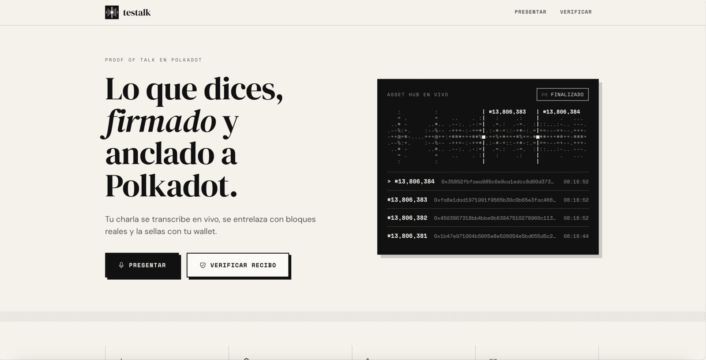

## 2. Prepara tu charla

Escribe el **título**, el **evento** y el **idioma**. Estos datos quedan dentro
del recibo firmado.

En **Palabras clave** pon nombres y términos de tu charla (Polkadot, Bulletin
Chain, el nombre de tu proyecto…). Ayudan al micrófono a escribirlos bien y
**no entran al recibo**.

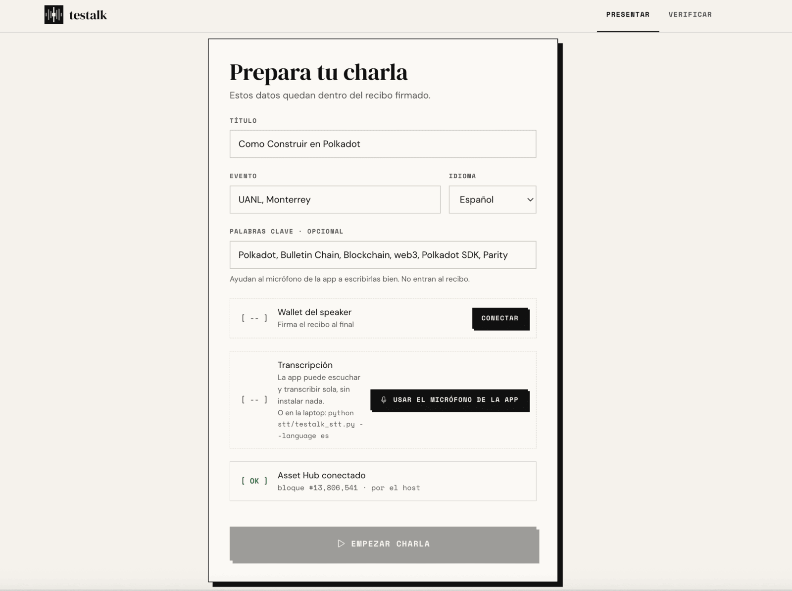

## 3. Conecta tu wallet y enciende el micrófono

1. Pulsa **Conectar** y acepta. Debe aparecer tu username con la nota
   *Firmarás con tu identidad .dot*.
2. Pulsa **Usar el micrófono de la app** y da permiso al micrófono. Empieza la
   descarga de Whisper.
3. Cuando diga **Micrófono de la app listo**, di algo: debajo aparece
   *Te escuché: «…»* con lo que entendió.
4. Revisa que **Asset Hub conectado** esté en `[ OK ]` y pulsa
   **Empezar charla**.

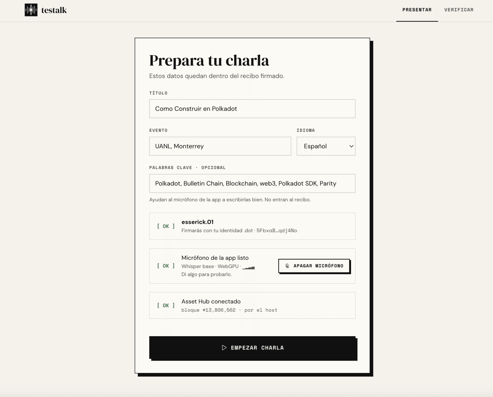

> Puedes empezar antes de que termine la descarga, pero lo que digas mientras
> carga no se transcribe. La tarjeta del micrófono lo avisa con el porcentaje.

## 4. Da tu charla

Cada frase aparece en grande y, entre frase y frase, se clava un **bloque de
Asset Hub** (`■ #13,806,571 · 0x9fd8…`). Eso prueba que el texto no pudo
escribirse antes de ese bloque.

- El texto llega por frases: aparece cuando haces una pausa corta, o cada
  20 segundos si hablas sin parar.
- **Apagar micrófono** (o la tecla **M**): lo que digas con el micrófono
  apagado no entra al recibo. Úsalo para preguntas del público o pausas.
- **Añadir frase a mano**: por si el micrófono falla.
- Si la app se recarga a media charla, al volver aparece **Recuperar charla
  sin sellar** con lo que ya llevabas. Cerrar Desktop sí la pierde.

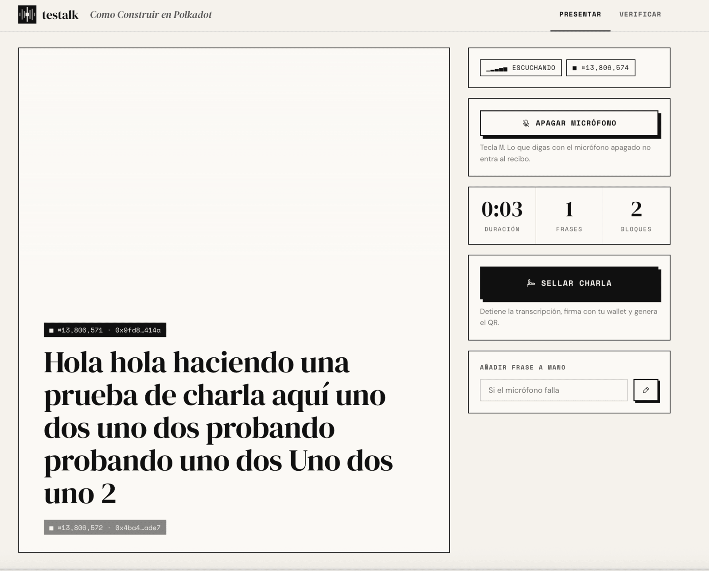

## 5. Sella la charla

Pulsa **Sellar charla**. El micrófono se apaga en ese momento; la app termina
de transcribir lo que ya dijiste y pide tu firma.

1. Desktop muestra **Solicitud de firma de mensaje sin procesar**. Pulsa
   **Continuar**.
2. Desktop te pide abrir Polkadot App. En el celular aparece **Polkadot
   Desktop requires signature · Raw bytes**. Pulsa **Sign**.

<table>
  <tr>
    <td width="36%">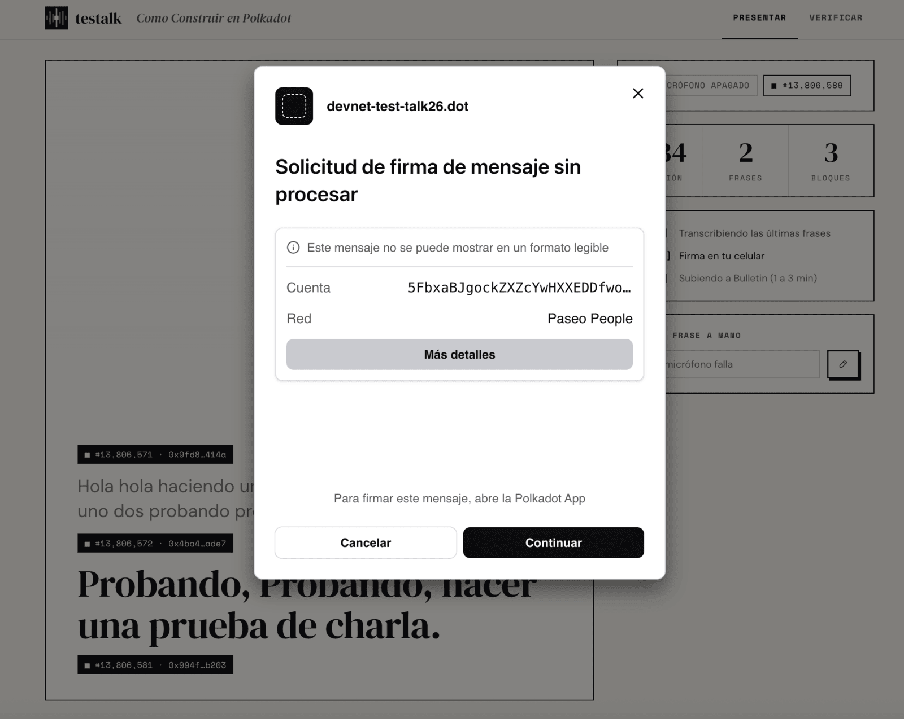</td>
    <td width="36%">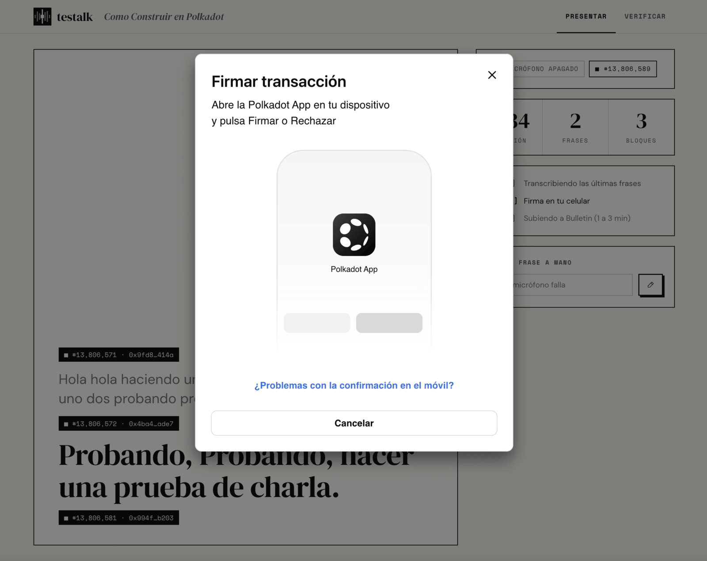</td>
    <td width="28%">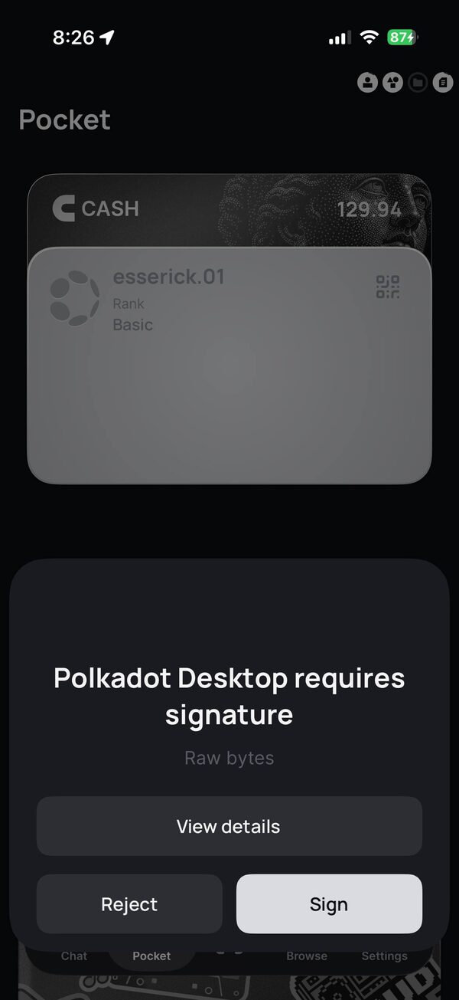</td>
  </tr>
</table>

3. Desktop pide guardar el recibo en Bulletin: **Solicitud de almacenamiento
   de datos (1.3 KB)**. Pulsa **Permitir**. La subida tarda de 1 a 3 minutos.

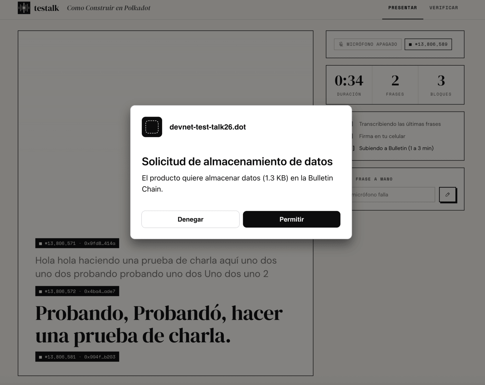

## 6. Comparte el QR

Aparece **Charla sellada** con el QR. Proyéctalo: el público lo escanea con la
cámara del celular y abre el recibo en el verificador.

- **JSON**: descárgalo y guárdalo. Bulletin borra el recibo a los 14 días; con
  el JSON y el sello permanente se puede seguir verificando.
- **Copiar JSON** y **Enlace**: por si la descarga no funciona o quieres
  mandar el enlace.

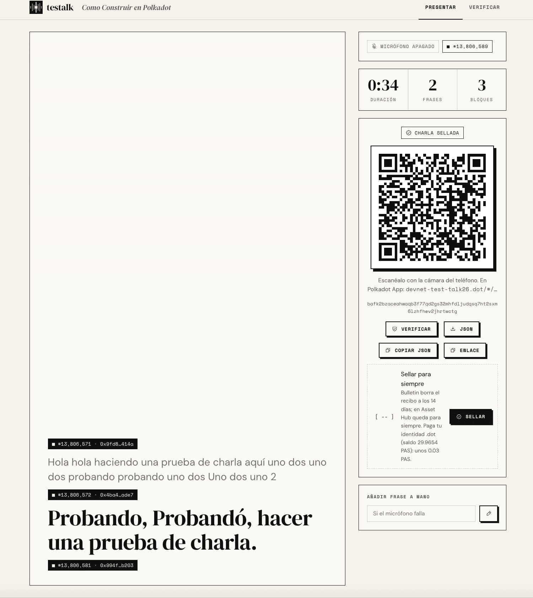

## 7. Sella para siempre

Debajo del QR está **Sellar para siempre**: guarda la huella del recibo, tu
firma y el CID en Asset Hub, donde no caduca. Dice quién paga y tu saldo.

1. Pulsa **Sellar**. La primera vez puede pedir permiso para enviar
   transacciones y registrar tu cuenta en Asset Hub (*Paso 1 de 2*); después
   ya no.
2. Desktop muestra **Solicitud de firma de Revive Call** con la comisión.
   Pulsa **Continuar**.
3. En el celular aparece **Polkadot Desktop requires signature · Revive.call**.
   Pulsa **Sign**.

<table>
  <tr>
    <td width="36%">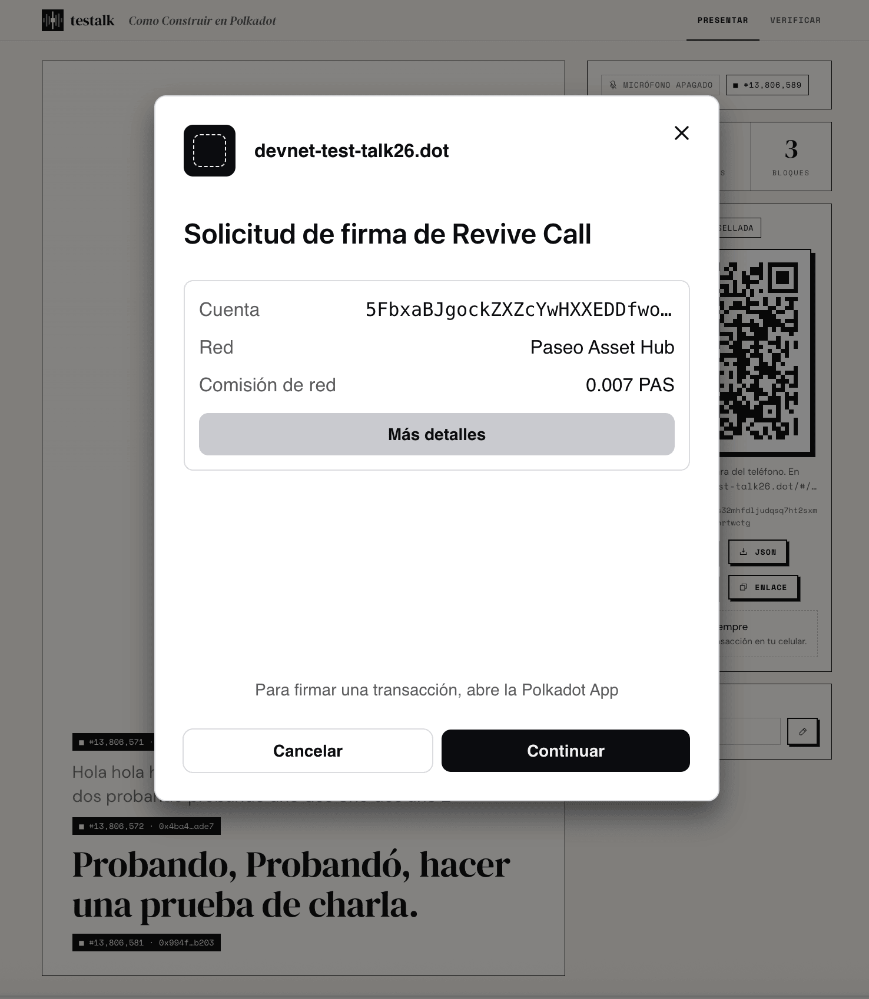</td>
    <td width="36%">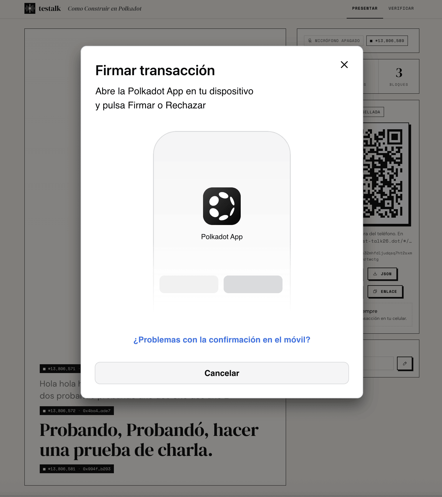</td>
    <td width="28%"></td>
  </tr>
</table>

4. Espera unos 20 segundos a que el bloque quede finalizado. Aparece
   **Sello permanente `[ OK ]`** con el número de bloque.

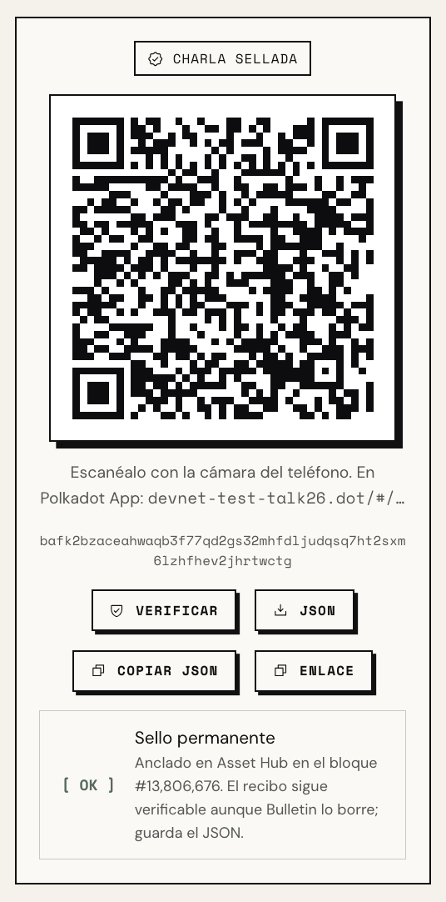

## 8. Verifica

Pulsa **Verificar**, o escanea el QR. El verificador comprueba todo sin
confiar en la app:

- **Firma válida**: nadie cambió una letra desde que se firmó.
- **Identidad verificada**: la llave que firmó es la dueña de tu username en
  People chain.
- **Anclada a Polkadot**: los bloques entre frases existen en Asset Hub.
- **Sello permanente**: el recibo está registrado en Asset Hub.

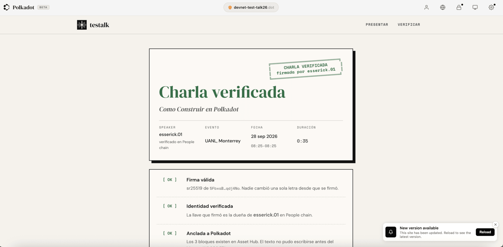

Más abajo está **Lo que se dijo**: cada frase con el bloque y la hora.

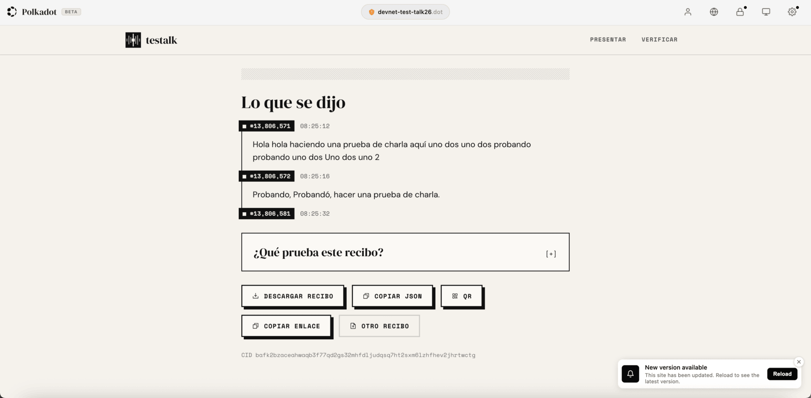

## Si algo falla

| Qué pasa | Qué hacer |
|---|---|
| El micrófono no escucha | Revisa la entrada de audio del sistema. Si no se arregla, usa **Añadir frase a mano**. |
| La descarga de Whisper va lenta | Es la red. No cierres Desktop: al reabrirlo vuelve a descargar desde cero. |
| Cancelaste la firma o no llegó al celular | Pulsa **Reintentar**. Si tu identidad no firma, **Firmar con la cuenta de la app** firma igual, pero el recibo no queda ligado a tu username (y lo dice). |
| Falla la subida a Bulletin | La charla ya está firmada: **Reintentar subida** no vuelve a pedir la firma. **Seguir sin Bulletin** te deja descargar el JSON. |
| *Sin sello permanente* | Tu cuenta no tiene saldo. Pide PAS en el faucet o pásale el JSON al organizador para que lo selle. |
| El sello no se confirmó a tiempo | Revisa en **Verificar** en un minuto antes de reintentar: pudo haber entrado. |

Antes del evento puedes abrir **`devnet-test-talk26.dot/#/diagnostico`**:
prueba el micrófono, la subida a Bulletin y el sello permanente (este último
simula y no envía nada), y genera un reporte para el organizador.
