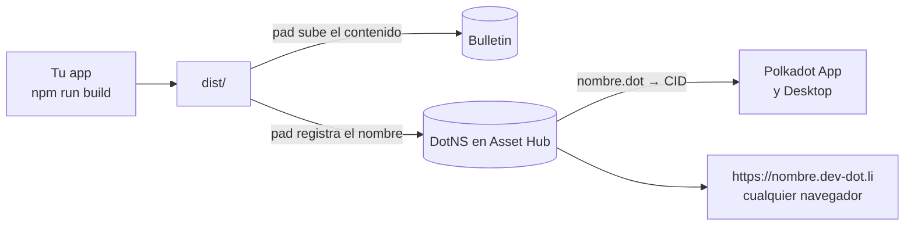

# Guía: publicar una app en Polkadot Products Devnet

Para estudiantes que van a publicar su primera app `.dot`. Cada paso está
comprobado publicando **testalk** el 25 y 26 de septiembre de 2026 con `pad` 0.16.7,
y los errores que aparecen aquí son los que salieron de verdad.

Si solo quieres los comandos, ve al [resumen](#resumen-en-8-comandos). Si algo
falla, ve a [Errores comunes](#errores-comunes).

## Qué vas a hacer



1. Compilas tu app a archivos estáticos (`dist/`).
2. `pad` sube esos archivos a **Bulletin**, la cadena de almacenamiento.
3. `pad` registra tu nombre en **DotNS** y lo apunta al contenido.
4. La app queda disponible como `nombre.dot` en Polkadot App y Polkadot
   Desktop, y como `https://nombre.dev-dot.li` en cualquier navegador.

## Resumen en 8 comandos

```bash
node --version                                    # 22 o más
npm i -g @polkadot-community-foundation/polkadot-app-deploy@latest \
         @polkadot-community-foundation/dotns-cli@latest
dotns lookup name <nombre> --env devnet           # ¿está libre?
pad login                                         # QR con Polkadot App
pad whoami --env devnet                           # ¿quedó la sesión?
npm run build                                     # genera dist/
PAD_ENV=devnet pad dist <nombre>.dot              # en Terminal.app, confirmar con Y
dotns content view <nombre> --env devnet          # ¿apunta al CID nuevo?
```

## 1. Requisitos

| Qué | Por qué |
|---|---|
| **Node 22 o más** | `pad` falla al arrancar con Node 20, con un error que no dice que es por la versión |
| **Polkadot App** en el celular, con username | Para `pad login`. Tras la actualización del devnet de septiembre de 2026 hubo que crear cuentas nuevas |
| Una **terminal normal** (Terminal.app en Mac) | `pad` pide confirmar con `Y`. En terminales integradas de algunos editores o asistentes el proceso corre en segundo plano y la tecla nunca le llega |
| Polkadot Desktop (opcional) | Para abrir `nombre.dot` desde una computadora |

## 2. Instalar las herramientas

```bash
npm i -g @polkadot-community-foundation/polkadot-app-deploy@latest \
         @polkadot-community-foundation/dotns-cli@latest
pad --version     # polkadot-app-deploy v0.16.7 o más
dotns --version   # 0.9.5 o más
```

Si `npm` responde `EACCES` (sin permisos para instalar globalmente), instala en
tu carpeta de usuario:

```bash
NPM_CONFIG_CACHE=/tmp/npm-cache npm install -g --prefix ~/.local \
  @polkadot-community-foundation/polkadot-app-deploy@latest \
  @polkadot-community-foundation/dotns-cli@latest
echo 'export PATH="$HOME/.local/bin:$PATH"' >> ~/.zshrc && source ~/.zshrc
```

`NPM_CONFIG_CACHE` evita otro error común: una caché de `npm` con carpetas que
pertenecen a `root`.

Instala siempre la **última** versión: la documentación oficial lo pide, y las
direcciones de los contratos de DotNS cambian con las actualizaciones del
devnet (en septiembre de 2026 se movieron). Para actualizar, repite el mismo
comando.

`pad` usa el binario de IPFS (Kubo) si lo tienes instalado. Si no, agrega
`--js-merkle` al comando de publicar.

## 3. Elegir el nombre, antes que nada

Es el paso donde más gente se atora. La regla del **protocolo v2 de DotNS**,
tal como la comprueba `pad` 0.16.7:

1. Los dígitos al final del nombre deben ser **0 o 2**. Con 1, o con 3 o más, el nombre está reservado.
2. Lo demás, sin esos dígitos, es la **base**.

| Base | Qué pide |
|---|---|
| 5 caracteres o menos | Reservado para gobernanza |
| 6 a 8 | Proof of Personhood: **Lite** si termina en 2 dígitos, **Full** si no tiene dígitos |
| **9 o más** | **Nada: registro abierto** |

Ejemplos reales:

| Nombre | Base | Resultado |
|---|---|---|
| `testalk` | 7 | Pide Full Personhood |
| `testalk26` | 7 (+2 dígitos) | Pide Personhood Lite: **falló** en la verificación previa |
| `devnet-test-talk26` | 16 (+2 dígitos) | Abierto: es el que usa testalk |
| `doomarcade00` | 10 (+2 dígitos) | Abierto |
| `mi-proyecto-uanl` | 16 | Abierto |
| `hola1` | 4 (+1 dígito) | Reservado |

> La documentación oficial lo resume como "nueve caracteres o más". La regla
> real cuenta la base **sin** los dígitos finales: `testalk26` tiene 9
> caracteres y aun así pide personhood.

Otras reglas: minúsculas, números y guiones (no al principio ni al final), de
3 a 63 caracteres.

Comprueba que esté libre:

```bash
dotns lookup name devnet-test-talk26 --env devnet
```

```
▶ Status
  status: not registered (no record)
```

## 4. Preparar el proyecto

La app se sirve desde el **hash de su contenido**, no desde la raíz de un
servidor. Eso obliga a tres cosas:

**Rutas relativas.** En Vite:

```ts
// vite.config.ts
import { defineConfig } from 'vite';
export default defineConfig({ base: './' });
```

**Rutas con `#`.** Usa `#/perfil`, no `/perfil`: no hay servidor que devuelva
`index.html` para una ruta profunda, así que daría 404. Escucha `hashchange`
para cambiar de vista; así el gesto de "atrás" del celular no cierra la app.

**Todo dentro del bundle.** No dependas de CDNs (Google Fonts, íconos
externos): el contenedor puede no tener acceso a ellos.

**Archivo de configuración** junto a tu `package.json`. Con él, `pad` también
publica el nombre, la descripción y el ícono que se ven en la app:

```ts
// polkadot-app-deploy.config.ts
export default {
  domain: 'devnet-test-talk26.dot',
  displayName: 'testalk',
  description: 'Graba tu charla, ánclala a bloques de Polkadot y fírmala con tu wallet.',
  icon: { path: './icon.png', format: 'png' },   // PNG o JPEG; 512×512 va bien
  executables: [
    { kind: 'app', path: './dist', appVersion: [0, 1, 0] },
  ],
};
```

**Script de publicación** en `package.json`:

```json
"deploy": "npm run build && PAD_ENV=devnet pad dist devnet-test-talk26.dot"
```

`PAD_ENV=devnet` es **obligatorio**: sin él, `pad` publica en otra red
(`paseo-next-v2`, su valor por defecto).

## 5. Iniciar sesión

```bash
pad login
```

Aparece un QR: escanéalo con Polkadot App y aprueba. El "SSO handshake" puede
quedarse varios minutos en `Submitting`; es normal en el devnet, espera antes
de cancelar.

```bash
pad whoami --env devnet
```

```
Logged in:
  Root address:    5ELdxE…cJvn72
  Product address: 5GQgZs…QNQeJMc
  H160 (EVM):      0xadb4…fba6
```

## 6. Publicar

En Terminal.app, desde la carpeta de tu proyecto:

```bash
npm run deploy
```

Lo que vas a ver (salida real del deploy de testalk, recortada):

```
============================================================
Preflight
============================================================
   Domain: devnet-test-talk26.dot
   DotNS: devnet-test-talk26.dot requires NoStatus
   Your PoP: NoStatus
   Domain: available
   DotNS: will register devnet-test-talk26.dot and transfer it to your account 0xadb4…fba6
   Authorization: expires at block 1063388 (current: 989870)
============================================================
Storage
============================================================
   CAR (3-section — Phase A): 1.09 MB …
   [1/2] chunk 0 — 0.99 MB (nonce: 3009)
   [2/2] chunk 1 — 0.10 MB (nonce: 3010)
   All 2 chunks verified ✓
   Root CID: bafybeigramb6472vlftoqiteccbnwduie5u5cynxprm74bg5pd6zmm3urm
   ✓ All 5 chunks finalised (waited 39s)
============================================================
DotNS
============================================================
   Required status: NoStatus
   Price: 10 PAS
   Submitting commitment... finalized
   Waiting for on-chain block.timestamp > … (timeout 90s)
   Finalizing registration for devnet-test-talk26.dot... finalized
   Setting contenthash: bafybeigramb…3urm
   Verified on-chain: bafybeigramb…3urm
   Handed devnet-test-talk26.dot to 0xadb4…fba6 (ok, …)
============================================================
DEPLOYMENT COMPLETE!
============================================================
   https://devnet-test-talk26.dev-dot.li
   devnet-test-talk26.dot  (in a Polkadot app: mobile or desktop)
```

Todo el proceso tardó unos 3 minutos. El `Revive.call: nonce contention (attempt 1/5)`
que puede aparecer en medio es un reintento automático: no hagas nada.

Qué pasa por dentro, en el modo por defecto (solo en testnet):

- Un **worker local** de `pad` sube el contenido a Bulletin, registra el nombre
  y paga las comisiones.
- Al final te **traspasa el nombre** a la cuenta con la que iniciaste sesión.
- Tu celular no firma nada. Si te llega un aviso de "allowance", puedes
  ignorarlo: a los 60 s `pad` sigue solo.
- Cuando pregunte si registra el nombre, confirma con **`Y`**.

Si prefieres que cada transacción la firme tu celular, agrega
`--no-transfer-to-signedin-user`.

### El manifest puede fallar, y la app funciona igual

Después de `DEPLOYMENT COMPLETE!`, `pad` intenta publicar el **manifest**: el
nombre, la descripción y el ícono que muestra Polkadot App. Con `pad` 0.16.7 y
`pad login` falla así:

```
Manifest publish failed: Contract execution would revert during setText on DOTNS_CONTENT_RESOLVER
  signer: 5DfhGy…RzV
```

Es un problema de orden en `pad`: primero te traspasa el nombre y después
intenta escribir el manifest con el worker, que ya no es dueño. En esta versión
el manifest solo se firma con `--mnemonic` o con la cuenta del worker, nunca
con tu sesión del celular.

- **La app funciona:** el nombre ya apunta al contenido. Solo falta la ficha en la galería de Polkadot App.
- **No** pongas la frase semilla de tu cuenta del celular en la terminal para arreglarlo.
- Si la ficha te importa, usa desde el principio una cuenta de deploy propia con `--mnemonic` (ver [Si publicas con tu propia cuenta](#si-publicas-con-tu-propia-cuenta)), o espera a una versión de `pad` que lo corrija.

## 7. Comprobar

```bash
dotns content view devnet-test-talk26 --env devnet    # debe mostrar el CID nuevo
```

- Navegador: `https://devnet-test-talk26.dev-dot.li`. Carga en unos 10 segundos: el cargador busca el nombre, baja el contenido y abre tu app en un iframe (`devnet-test-talk26.app.dev-dot.li`). Las rutas con `#` llegan intactas: `…dev-dot.li/#/diagnostico` abre directo esa vista.
- Polkadot Desktop: escribe `devnet-test-talk26.dot` en la barra de direcciones.
- Celular: el celular no tiene barra de direcciones, así que abre la app desde **Browse** o desde un enlace.

Para aparecer en Browse agrega `--publish` al comando; eso sí pide proof of
personhood.

### Comprobar que todo quedó on-chain, y hasta cuándo

Que la app abra no prueba que todo esté en Bulletin, ni cuánto tiempo va a
seguir ahí. testalk trae un script que lo mide en la cadena
([`app/scripts/check-deploy.ts`](../app/scripts/check-deploy.ts); cópialo a tu
app y cambia el nombre en `network.ts`):

```bash
npm run check-deploy
```

Salida real después de la sexta publicación de testalk (26 sep 2026):

```
devnet-test-talk26.dot → bafybeib3m7hdv4ylu6dygrbifkfivpkebr4u5klyauzyktuojliicpbwsy
✓ dist/ reconstruido da el mismo CID (4 chunks, 2.26 MB)
✓ raíz  bafybeib3m7hdv4ylu6d… bloque 1001400 → caduca ~2026-10-12 19:28 UTC
✓ chunk bafkreibkjlgyxpfo3fv… bloque 1001396 → caduca ~2026-10-12 19:27 UTC
✓ chunk bafkreieit6lapydobeu… bloque 1001393 → caduca ~2026-10-12 19:27 UTC
✓ chunk bafkreid5x2er3qgob5c… bloque 1001398 → caduca ~2026-10-12 19:28 UTC
✓ chunk bafkreicq2mlhryiieyg… bloque 1001398 → caduca ~2026-10-12 19:28 UTC
  Lo primero que caduca: en 201560 bloques, entre 2026-10-10 17:04 y 2026-10-13 12:15 UTC
✓ el gateway IPFS entrega el deploy idéntico byte por byte a dist/
✓ https://devnet-test-talk26.dev-dot.li responde 200
```

Cómo funciona, por si quieres hacerlo a mano:

- `pad` no sube archivos sueltos: arma un CAR con todo `dist/` y lo parte en
  **chunks** de hasta 2 MB, y cada chunk es una transacción en Bulletin.
- El CID que guarda DotNS **no es el de tu carpeta**: es un nodo que enlaza esos
  chunks. Por eso `https://devnet-ipfs.api.polkadotcommunity.foundation/ipfs/<cid>`
  entrega el CAR completo, y `…/<cid>/index.html` da 404.
- `TransactionStorage.TransactionByContentHash(<hash del chunk>)` dice en qué
  bloque se guardó cada chunk. Caduca en ese bloque + `RetentionPeriod`
  (201,600 bloques: 14 días nominales, unos 16 reales porque los bloques
  tardan de 6.5 a 7.2 s).

## 8. Publicar una versión nueva

Repite `npm run deploy`. `pad` solo sube lo que cambió y apunta el nombre al
contenido nuevo. Como el nombre ya es tuyo, esta vez avisa
*"You already own … updating its content needs your signature"* y te pide
**una firma en el celular**.

Así se ve (salida real de la segunda publicación de testalk):

```
   Domain: owned by you
   DotNS: you already own devnet-test-talk26.dot — content update needs your phone signature (no transfer)
   Incremental: previous contenthash bafybeigramb…3urm
   Files:         15 unchanged, 2 changed (88 % stable)
   You already own devnet-test-talk26.dot — updating its content needs your signature.
   Check your phone → Link content
   Press Y when ready — you'll have ~90s to approve on your phone (Ctrl-C to abort):
   > Y
   Verified on-chain: bafybeifr4aj4nawpm7hdywg3weoaeqzdiaez4c3bduduukrhz2g4qmoxpu
```

1. Ten el celular a la mano con Polkadot App abierta.
2. Escribe `Y` en la terminal **y después** aprueba "Link content" en el celular: tienes unos 90 s.
3. Si la publicación anterior terminó con el error del manifest, verás `Previous deploy did not exit cleanly. Continuing.`: es normal.

Cada versión tiene **otro origen** (otro hash), así que el `localStorage` del
navegador empieza vacío. Para datos que deben sobrevivir entre versiones usa
`getHostLocalStorage()` del SDK, y no publiques durante un evento en vivo.

### Lo que no cambió no se vuelve a subir, y caduca antes

En una versión nueva, `pad` 0.16.7 da por buenos los chunks que ya venían en
la versión anterior: **no los vuelve a subir ni comprueba que sigan en
Bulletin**. Lo dice así:

```
   Trusted: 1 chunks skipped without re-probe (chunks 1)
```

Esos chunks conservan el bloque de su **primera** subida, así que caducan 14
días después de esa subida, no de la publicación nueva. Si publicaste el 1 de
octubre y vuelves a publicar el 20 cambiando solo el JavaScript, las fuentes y
las imágenes pueden desaparecer el 15 aunque la versión del 20 parezca nueva.
Cuando el conjunto de archivos que no cambian sí cambia (agregas o quitas
uno), `pad` sube ese chunk otra vez: en la sexta publicación de testalk los 4
chunks quedaron del mismo día.

`pad` 0.16.7 no tiene opción para forzar una subida completa. Antes de un
evento, corre `npm run check-deploy` y mira **"Lo primero que caduca"**: tiene
que caer después de que termine el evento.

## 9. La app y el host deben hablar el mismo protocolo

Este es el error más difícil de ver, así que va antes que todo lo demás del SDK.

Tu app habla con el host (Polkadot App, Desktop o el gateway) con un protocolo
binario que tiene **versión de códec**. Si la app y el host no usan la misma,
el canal se abre, el SDK dice `connected`, y **ninguna petición recibe
respuesta**: ni permisos, ni cuentas, ni firmas. No hay error; todo se queda
esperando.

| Paquete de tu app | Códec |
|---|---|
| `@parity/truapi` 0.5.1 a 0.13.1 (`product-sdk-host` 0.14.1 a 0.19.1, `product-sdk-signer` 0.11.1 a 0.14.4) | **1** |
| `@parity/truapi` 0.16.0 en adelante (`product-sdk-host` 0.20.0+, `product-sdk-signer` 0.14.5+) | 2 |

Polkadot Desktop 0.1.3 (septiembre de 2026) habla el **códec 1**. Con él
funcionan `product-sdk-host` **0.19.1** + `product-sdk-signer` **0.14.4**
(o el paquete `@parity/product-sdk` **0.27.0**, que trae esa pareja):

```bash
npm install --save-exact @parity/product-sdk-host@0.19.1 @parity/product-sdk-signer@0.14.4
npm ls @parity/product-sdk-host @parity/truapi    # debe haber UNA sola copia de cada uno
```

Cómo saber qué habla tu host, sin adivinar:

```bash
# Versión del protocolo que trae Polkadot Desktop (Mac)
npx @electron/asar extract-file "/Applications/Polkadot Desktop Dev.app/Contents/Resources/app.asar" \
  node_modules/@novasamatech/host-api/dist/constants.js && cat constants.js
# → export const SCALE_CODEC_PROTOCOL_ID = 1;

# Versión que habla tu app
grep -h "TRUAPI_CODEC_VERSION = " node_modules/@parity/truapi/dist/generated/client.js
```

Cuando actualices la app o salga un Desktop nuevo, vuelve a comprobarlo:
"instala siempre la última versión" aplica a `pad` y `dotns`, **no** al SDK de
tu app mientras los hosts no hablen el mismo códec.

## 10. Programar para el contenedor

Tu app corre dentro de Polkadot App, Polkadot Desktop o el gateway
`dev-dot.li`, que se comunica con el "host". Lo que más trabajo cuesta
descubrir, con el código de testalk como referencia:

| Tema | Qué hacer | En testalk |
|---|---|---|
| Canal con el host | Espera a que esté `connected` antes de cualquier llamada, y ponle **tope de tiempo a todas**: una llamada colgada no lanza error, se queda pendiente para siempre | [`lib/host.ts`](../app/src/lib/host.ts) |
| Red | Pide el permiso `Remote` con cada dominio externo **al arrancar**. Sin él, `fetch` y WebSocket fallan en silencio | [`lib/permissions.ts`](../app/src/lib/permissions.ts) |
| Permisos del dispositivo | `Clipboard` para copiar y `OpenUrl` para abrir enlaces externos en el celular | [`lib/permissions.ts`](../app/src/lib/permissions.ts) |
| Cuentas | `SignerManager` entrega una **cuenta de producto** derivada para tu dominio, no la identidad del usuario. Para firmar como la persona, usa la cuenta dueña de su username en People chain | [`lib/signer.ts`](../app/src/lib/signer.ts), [`lib/people.ts`](../app/src/lib/people.ts) |
| Bulletin | `requestResourceAllocation([{ tag: 'BulletinAllowance' }])`, luego el permiso `PreimageSubmit` (no `ChainSubmit`), luego `submit()`. Una cuota `NotAvailable` no impide subir. En Polkadot Desktop 0.1.3 subió 58 bytes en 10 s (TWR midió 64 s en la 0.1.1), y los datos se borran a los **14 días**. Para leer fuera del contenedor, el gateway IPFS `https://devnet-ipfs.api.polkadotcommunity.foundation/ipfs/<cid>` sirve contenido de Bulletin (medido con un CID `bafk2bza…` en 0.3 s) | [`lib/bulletin.ts`](../app/src/lib/bulletin.ts) |
| Cadenas | `getHostProvider(genesis)` dentro del contenedor, RPC público fuera | [`lib/chain.ts`](../app/src/lib/chain.ts) |
| Enlaces y QR | `https://nombre.dev-dot.li/...` abre en cualquier celular; `nombre.dot` solo dentro de Polkadot App | [`views/presenter.ts`](../app/src/views/presenter.ts) |
| Micrófono | `requestDevicePermission('Microphone')` y luego `getUserMedia`. En Polkadot Desktop 0.1.3 funciona, y el permiso queda en Ajustes → Permisos → Micrófono. Para apagarlo de verdad, detén las pistas del `MediaStream` | [`lib/mic.ts`](../app/src/lib/mic.ts) |
| Trabajo pesado (IA, criptografía) | Hazlo en un **Web Worker**: Whisper en el hilo principal congelaba la página hasta 90 s; en un worker, 0-2 ms | [`lib/whisper.worker.ts`](../app/src/lib/whisper.worker.ts) |
| Diagnóstico | Una página que pruebe cada pieza **en el dispositivo real** y dé un reporte copiable. Te ahorra días de adivinar | [`views/diagnostics.ts`](../app/src/views/diagnostics.ts) |

### Las redes del devnet

El Products Devnet corre sobre **Paseo**. Los smart contracts viven en el
**Asset Hub de Paseo** con **pallet-revive** (PolkaVM y EVM), la misma cadena
donde están los contratos de DotNS.

| Cadena | Genesis | Para qué |
|---|---|---|
| Asset Hub (para 1000) | `0xd6eec26135305a8ad257a20d003357284c8aa03d0bdb2b357ab0a22371e11ef2` | Contratos, DotNS, bloques |
| People (para 1004) | `0xe6c30d6e148f250b887105237bcaa5cb9f16dd203bf7b5b9d4f1da7387cb86ec` | Usernames y personhood |
| Bulletin (para 1010) | `0xe101f0fa4627d29a257645e02be86d80378fea1a2bf8fa6a918d150ebc760a59` | Almacenamiento de apps y datos (14 días) |

Para contratos:

| Dato | Valor |
|---|---|
| EVM chain ID | `420420417` (comprobado con `eth_chainId` el 25 sep 2026) |
| RPC Ethereum | `https://eth-rpc-testnet.polkadot.io` |
| RPC Substrate | `wss://asset-hub-paseo-rpc.n.dwellir.com`, `wss://sys.turboflakes.io/asset-hub-paseo` |
| Token | PAS, 10 decimales ([faucet](https://faucet.polkadot.io)) |

No lo confundas con **Paseo Next** (`paseo-next-v2`): es otra red, con otro
Asset Hub, y es la que usan `pad` y `dotns` si olvidas `--env devnet`.

Dentro del contenedor, pide cada cadena al host con `getHostProvider(genesis)`
y ten un **RPC público de respaldo**: el host puede tardar o no entregarla, y
los hashes y contratos son los mismos por cualquier camino.

Límites medidos por otros equipos ([TWR.DOT](https://github.com/TheWhiteRabbitM/TWR.DOT/blob/master/docs/devnet-issues.md)):

- En **Android**, subir a Bulletin falla con un error de códec; en Desktop funciona.
- En el gateway `dev-dot.li`, desde un navegador de escritorio, **no se puede firmar**: `SignerManager` devuelve cero cuentas. Leer sí funciona.
- `navigateTo` a una URL externa responde `ok` y no abre nada.

## Lo que la documentación no te dice

El Products Devnet está en beta y cambia cada semana: el SDK saca versiones
casi a diario (`product-sdk-host` pasó de 0.14 a 0.23 entre julio y septiembre
de 2026), el protocolo entre app y host cambió de códec a mitad de septiembre,
y la actualización del devnet de ese mes obligó a crear cuentas nuevas y movió
los contratos de DotNS. La documentación oficial describe el camino ideal y va
por detrás. Esto es lo que medimos el 25 y 26 de septiembre de 2026:

| La documentación dice | Lo que pasó de verdad |
|---|---|
| *"Install the latest release of every package"* | Vale para `pad` y `dotns`. Para el SDK de tu app, **no**: el más nuevo habla el códec 2 y Polkadot Desktop 0.1.3 el 1 ([sección 9](#9-la-app-y-el-host-deben-hablar-el-mismo-protocolo)) |
| *"Use labels nine characters or longer"* | Se cuenta la base **sin** los dígitos finales: `testalk26` tiene 9 caracteres y pidió personhood ([paso 3](#3-elegir-el-nombre-antes-que-nada)) |
| *"Reads are container-only; there is no public IPFS-gateway fallback"* | El gateway IPFS del devnet sirvió lo que subió el host con `submit()` en 274 ms, byte por byte |
| El archivo de configuración publica nombre, descripción e ícono | Con `pad login`, en `pad` 0.16.7 el manifest falla siempre ([paso 6](#el-manifest-puede-fallar-y-la-app-funciona-igual)) |
| `SignerManager` para conectar la wallet | Entrega una cuenta **derivada para tu app**, no la identidad del usuario. Para firmar como la persona: username → dueño en People chain → `getLegacyAccountSigner(...).signBytes`; en Desktop 0.1.3 funciona (13 s) aunque `getLegacyAccounts()` devuelva 0 cuentas |
| `getHostProvider(genesis)` para leer cadenas | En Desktop 0.1.3 no entregó Asset Hub: hace falta un RPC de respaldo |
| (no lo menciona) | En Android subir a Bulletin falla; en el gateway web no se puede firmar ([TWR.DOT](https://github.com/TheWhiteRabbitM/TWR.DOT/blob/master/docs/devnet-issues.md)) |
| (no lo menciona) | Una versión nueva no vuelve a subir lo que no cambió, y eso caduca con la fecha de su primera subida ([paso 8](#lo-que-no-cambió-no-se-vuelve-a-subir-y-caduca-antes)) |
| (no lo menciona) | Vite copia a `dist/` archivos que tu app nunca pide, y `pad` los sube igual. Con transformers.js se colaba un wasm de 27 MB: al quitarlo ([`vite.config.ts`](../app/vite.config.ts)) el deploy de testalk pasó de 28 MB a 2.2 MB. Revisa `du -sh dist` antes de publicar |

La lección: **no confíes en que algo funciona porque está documentado**.
Pon una página de diagnóstico en tu app, córrela en el dispositivo real y
cree lo que mide. Y cuando encuentres una diferencia, repórtala en
[products-devnet-issues](https://github.com/Polkadot-Community-Foundation/products-devnet-issues):
así el siguiente estudiante no pierde el mismo día.

## Errores comunes

| Síntoma | Causa | Qué hacer |
|---|---|---|
| El SDK dice `connected` pero **nada** responde: permisos, cuentas, firmas | Tu app y el host hablan distinta versión de códec | [Sección 9](#9-la-app-y-el-host-deben-hablar-el-mismo-protocolo): usa `product-sdk-host` 0.19.1 + `signer` 0.14.4 con Desktop 0.1.3 |
| `testalk26.dot requires ProofOfPersonhoodLite, but this signer is NoStatus` | La base del nombre tiene menos de 9 caracteres | Elige un nombre con base de 9 o más ([paso 3](#3-elegir-el-nombre-antes-que-nada)). No se gastó nada: falló en la verificación previa |
| La app aparece en otra red o el nombre "no existe" | Faltó `--env devnet` o `PAD_ENV=devnet` | Agrégalo en todos los comandos de `pad` y `dotns` |
| `pad` se queda esperando y la `Y` no hace nada | La terminal manda el proceso a segundo plano | Usa Terminal.app u otra terminal normal |
| `Submitting` gira varios minutos | El devnet es lento en ese paso | Espera de 3 a 5 minutos antes de cancelar |
| La subida funcionaba y ahora se detiene | Se venció la autorización de almacenamiento de Bulletin (si publicas con tu propia cuenta) | Storage Faucet del Bulletin Chain Console, o `dotns bulletin authorize <ss58> --transactions 1000 --bytes 104857600 --env devnet` |
| Error raro al arrancar `pad` | Node 20 | Instala Node 22 o más |
| Página en blanco o 404 al entrar a una ruta | Rutas absolutas o sin `#` | `base: './'` y rutas con `#` ([paso 4](#4-preparar-el-proyecto)) |
| "Failed to load content" al abrir la app | Fallo intermitente del cliente ligero al bajar el bundle | Reintenta, o cambia la fuente de contenido de **Verified** a **Trusted** |
| Un `fetch` a una API externa no hace nada | Falta el permiso `Remote` para ese dominio | Pídelo al arrancar |
| El botón de firmar se queda cargando | Llamada al host sin tope, o sin permiso `ChainSubmit` | `SignerManager.connect()` lo pide solo; pon tope a toda llamada al host |
| Los datos guardados desaparecen al publicar | `localStorage` cambia de origen en cada versión | `getHostLocalStorage()` |
| `npm install -g` responde `EACCES` | Sin permisos para instalar globalmente | `--prefix ~/.local` ([paso 2](#2-instalar-las-herramientas)) |
| `Manifest publish failed: … revert during setText` | `pad` traspasó el nombre antes de escribir el manifest | La app funciona igual ([ver arriba](#el-manifest-puede-fallar-y-la-app-funciona-igual)) |
| `Revive.call: nonce contention (attempt 1/5)` | Dos transacciones seguidas del worker | Nada: `pad` reintenta solo |

## Si publicas con tu propia cuenta

El modo por defecto usa el worker de `pad` y no necesita nada más. Si en su
lugar usas `--mnemonic` o `--no-transfer-to-signedin-user`, tu cuenta necesita:

1. PAS en Asset Hub (del [faucet](https://faucet.polkadot.io)).
2. Cuenta mapeada para contratos: `dotns account map --env devnet`.
3. Autorización de almacenamiento de Bulletin (Storage Faucet o `dotns bulletin authorize`).

## Referencias

- Documentación de PCF: [Build & Publish](https://docs.polkadotcommunity.foundation/guides/build-and-publish/), [Networks](https://docs.polkadotcommunity.foundation/reference/networks/), [Platform services SDK](https://docs.polkadotcommunity.foundation/guides/platform-services-sdk/)
- [TWR.DOT](https://github.com/TheWhiteRabbitM/TWR.DOT): 30 apps funcionando en el devnet; `docs/devnet-issues.md` y `DEVFEEDBACK.md` documentan los problemas reales
- En este repo: [deploy de testalk](deploy.md), [revisión de plataforma](platform-review-2026-09-25.md)
