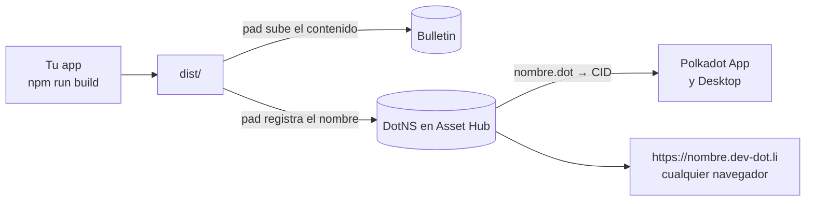

# Guía: publicar una app en Polkadot Products Devnet

Para estudiantes que van a publicar su primera app `.dot`. Cada paso está
comprobado publicando **testalk** el 25 de septiembre de 2026 con `pad` 0.16.7,
y los errores que aparecen aquí son los que salieron de verdad.

Si solo quieres los comandos, ve al [resumen](#resumen-en-8-comandos). Si algo
falla, ve a [Errores comunes](#errores-comunes).

## Qué vas a hacer



1. Compilas tu app a archivos estáticos (`dist/`).
2. `pad` sube esos archivos a **Bulletin**, la cadena de almacenamiento.
3. `pad` registra tu nombre en **DotNS** y lo apunta al contenido.
4. La app queda disponible como `nombre.dot` en Polkadot App y Polkadot
   Desktop, y como `https://nombre.dev-dot.li` en cualquier navegador.

## Resumen en 8 comandos

```bash
node --version                                    # 22 o más
npm i -g @polkadot-community-foundation/polkadot-app-deploy@latest \
         @polkadot-community-foundation/dotns-cli@latest
dotns lookup name <nombre> --env devnet           # ¿está libre?
pad login                                         # QR con Polkadot App
pad whoami --env devnet                           # ¿quedó la sesión?
npm run build                                     # genera dist/
PAD_ENV=devnet pad dist <nombre>.dot              # en Terminal.app, confirmar con Y
dotns content view <nombre> --env devnet          # ¿apunta al CID nuevo?
```

## 1. Requisitos

| Qué | Por qué |
|---|---|
| **Node 22 o más** | `pad` falla al arrancar con Node 20, con un error que no dice que es por la versión |
| **Polkadot App** en el celular, con username | Para `pad login`. Tras la actualización del devnet de septiembre de 2026 hubo que crear cuentas nuevas |
| Una **terminal normal** (Terminal.app en Mac) | `pad` pide confirmar con `Y`. En terminales integradas de algunos editores o asistentes el proceso corre en segundo plano y la tecla nunca le llega |
| Polkadot Desktop (opcional) | Para abrir `nombre.dot` desde una computadora |

## 2. Instalar las herramientas

```bash
npm i -g @polkadot-community-foundation/polkadot-app-deploy@latest \
         @polkadot-community-foundation/dotns-cli@latest
pad --version     # polkadot-app-deploy v0.16.7 o más
dotns --version   # 0.9.5 o más
```

Si `npm` responde `EACCES` (sin permisos para instalar globalmente), instala en
tu carpeta de usuario:

```bash
NPM_CONFIG_CACHE=/tmp/npm-cache npm install -g --prefix ~/.local \
  @polkadot-community-foundation/polkadot-app-deploy@latest \
  @polkadot-community-foundation/dotns-cli@latest
echo 'export PATH="$HOME/.local/bin:$PATH"' >> ~/.zshrc && source ~/.zshrc
```

`NPM_CONFIG_CACHE` evita otro error común: una caché de `npm` con carpetas que
pertenecen a `root`.

Instala siempre la **última** versión: la documentación oficial lo pide, y las
direcciones de los contratos de DotNS cambian con las actualizaciones del
devnet (en septiembre de 2026 se movieron). Para actualizar, repite el mismo
comando.

`pad` usa el binario de IPFS (Kubo) si lo tienes instalado. Si no, agrega
`--js-merkle` al comando de publicar.

## 3. Elegir el nombre, antes que nada

Es el paso donde más gente se atora. La regla del **protocolo v2 de DotNS**,
tal como la comprueba `pad` 0.16.7:

1. Los dígitos al final del nombre deben ser **0 o 2**. Con 1, o con 3 o más, el nombre está reservado.
2. Lo demás, sin esos dígitos, es la **base**.

| Base | Qué pide |
|---|---|
| 5 caracteres o menos | Reservado para gobernanza |
| 6 a 8 | Proof of Personhood: **Lite** si termina en 2 dígitos, **Full** si no tiene dígitos |
| **9 o más** | **Nada: registro abierto** |

Ejemplos reales:

| Nombre | Base | Resultado |
|---|---|---|
| `testalk` | 7 | Pide Full Personhood |
| `testalk26` | 7 (+2 dígitos) | Pide Personhood Lite: **falló** en la verificación previa |
| `devnet-test-talk26` | 16 (+2 dígitos) | Abierto: es el que usa testalk |
| `doomarcade00` | 10 (+2 dígitos) | Abierto |
| `mi-proyecto-uanl` | 16 | Abierto |
| `hola1` | 4 (+1 dígito) | Reservado |

> La documentación oficial lo resume como "nueve caracteres o más". La regla
> real cuenta la base **sin** los dígitos finales: `testalk26` tiene 9
> caracteres y aun así pide personhood.

Otras reglas: minúsculas, números y guiones (no al principio ni al final), de
3 a 63 caracteres.

Comprueba que esté libre:

```bash
dotns lookup name devnet-test-talk26 --env devnet
```

```
▶ Status
  status: not registered (no record)
```

## 4. Preparar el proyecto

La app se sirve desde el **hash de su contenido**, no desde la raíz de un
servidor. Eso obliga a tres cosas:

**Rutas relativas.** En Vite:

```ts
// vite.config.ts
import { defineConfig } from 'vite';
export default defineConfig({ base: './' });
```

**Rutas con `#`.** Usa `#/perfil`, no `/perfil`: no hay servidor que devuelva
`index.html` para una ruta profunda, así que daría 404. Escucha `hashchange`
para cambiar de vista; así el gesto de "atrás" del celular no cierra la app.

**Todo dentro del bundle.** No dependas de CDNs (Google Fonts, íconos
externos): el contenedor puede no tener acceso a ellos.

**Archivo de configuración** junto a tu `package.json`. Con él, `pad` también
publica el nombre, la descripción y el ícono que se ven en la app:

```ts
// polkadot-app-deploy.config.ts
export default {
  domain: 'devnet-test-talk26.dot',
  displayName: 'testalk',
  description: 'Graba tu charla, ánclala a bloques de Polkadot y fírmala con tu wallet.',
  icon: { path: './icon.png', format: 'png' },   // PNG o JPEG; 512×512 va bien
  executables: [
    { kind: 'app', path: './dist', appVersion: [0, 1, 0] },
  ],
};
```

**Script de publicación** en `package.json`:

```json
"deploy": "npm run build && PAD_ENV=devnet pad dist devnet-test-talk26.dot"
```

`PAD_ENV=devnet` es **obligatorio**: sin él, `pad` publica en otra red
(`paseo-next-v2`, su valor por defecto).

## 5. Iniciar sesión

```bash
pad login
```

Aparece un QR: escanéalo con Polkadot App y aprueba. El "SSO handshake" puede
quedarse varios minutos en `Submitting`; es normal en el devnet, espera antes
de cancelar.

```bash
pad whoami --env devnet
```

```
Logged in:
  Root address:    5ELdxE…cJvn72
  Product address: 5GQgZs…QNQeJMc
  H160 (EVM):      0xadb4…fba6
```

## 6. Publicar

En Terminal.app, desde la carpeta de tu proyecto:

```bash
npm run deploy
```

Lo que vas a ver:

```
   Worker: dev signer 5DfhGy…RzV (signs Bulletin storage)
   Storage signer: worker 5DfhGy…RzV (transfer mode)
============================================================
DEPLOYING TO TESTNET                    v0.16.7
============================================================
   Environment: Products Devnet
============================================================
Preflight
============================================================
   DotNS protocol v2 detected on devnet
   Account: auto-mapped (Revive.OriginalAccount confirmed)
   Domain: devnet-test-talk26.dot
```

Qué pasa por dentro, en el modo por defecto (solo en testnet):

- Un **worker local** de `pad` sube el contenido a Bulletin, registra el nombre
  y paga las comisiones.
- Al final te **traspasa el nombre** a la cuenta con la que iniciaste sesión.
- Tu celular no firma nada. Si te llega un aviso de "allowance", puedes
  ignorarlo: a los 60 s `pad` sigue solo.
- Cuando pregunte si registra el nombre, confirma con **`Y`**.

Si prefieres que cada transacción la firme tu celular, agrega
`--no-transfer-to-signedin-user`.

## 7. Comprobar

```bash
dotns content view devnet-test-talk26 --env devnet    # debe mostrar el CID nuevo
```

- Navegador: `https://devnet-test-talk26.dev-dot.li`
- Polkadot Desktop: escribe `devnet-test-talk26.dot` en la barra de direcciones.
- Celular: el celular no tiene barra de direcciones, así que abre la app desde **Browse** o desde un enlace.

Para aparecer en Browse agrega `--publish` al comando; eso sí pide proof of
personhood.

## 8. Publicar una versión nueva

Repite `npm run deploy`. `pad` solo sube lo que cambió y apunta el nombre al
contenido nuevo.

Cada versión tiene **otro origen** (otro hash), así que el `localStorage` del
navegador empieza vacío. Para datos que deben sobrevivir entre versiones usa
`getHostLocalStorage()` del SDK, y no publiques durante un evento en vivo.

## 9. Programar para el contenedor

Tu app corre dentro de Polkadot App, Polkadot Desktop o el gateway
`dev-dot.li`, que se comunica con el "host". Lo que más trabajo cuesta
descubrir, con el código de testalk como referencia:

| Tema | Qué hacer | En testalk |
|---|---|---|
| Canal con el host | Espera a que esté `connected` antes de cualquier llamada, y ponle **tope de tiempo a todas**: una llamada colgada no lanza error, se queda pendiente para siempre | [`lib/host.ts`](../app/src/lib/host.ts) |
| Red | Pide el permiso `Remote` con cada dominio externo **al arrancar**. Sin él, `fetch` y WebSocket fallan en silencio | [`lib/permissions.ts`](../app/src/lib/permissions.ts) |
| Permisos del dispositivo | `Clipboard` para copiar y `OpenUrl` para abrir enlaces externos en el celular | [`lib/permissions.ts`](../app/src/lib/permissions.ts) |
| Cuentas | `SignerManager` entrega una **cuenta de producto** derivada para tu dominio, no la identidad del usuario. Para firmar como la persona, usa la cuenta dueña de su username en People chain | [`lib/signer.ts`](../app/src/lib/signer.ts), [`lib/people.ts`](../app/src/lib/people.ts) |
| Bulletin | `requestResourceAllocation([{ tag: 'BulletinAllowance' }])`, luego el permiso `PreimageSubmit` (no `ChainSubmit`), luego `submit()`. Una cuota `NotAvailable` no impide subir. Tarda alrededor de 1 minuto, y los datos se borran a los **14 días** | [`lib/bulletin.ts`](../app/src/lib/bulletin.ts) |
| Cadenas | `getHostProvider(genesis)` dentro del contenedor, RPC público fuera | [`lib/chain.ts`](../app/src/lib/chain.ts) |
| Enlaces y QR | `https://nombre.dev-dot.li/...` abre en cualquier celular; `nombre.dot` solo dentro de Polkadot App | [`views/presenter.ts`](../app/src/views/presenter.ts) |
| Diagnóstico | Una página que pruebe cada pieza **en el dispositivo real** y dé un reporte copiable. Te ahorra días de adivinar | [`views/diagnostics.ts`](../app/src/views/diagnostics.ts) |

Genesis de las cadenas del devnet:

| Cadena | Genesis |
|---|---|
| Asset Hub | `0xd6eec26135305a8ad257a20d003357284c8aa03d0bdb2b357ab0a22371e11ef2` |
| People | `0xe6c30d6e148f250b887105237bcaa5cb9f16dd203bf7b5b9d4f1da7387cb86ec` |
| Bulletin | `0xe101f0fa4627d29a257645e02be86d80378fea1a2bf8fa6a918d150ebc760a59` |

Límites medidos por otros equipos ([TWR.DOT](https://github.com/TheWhiteRabbitM/TWR.DOT/blob/master/docs/devnet-issues.md)):

- En **Android**, subir a Bulletin falla con un error de códec; en Desktop funciona.
- En el gateway `dev-dot.li`, desde un navegador de escritorio, **no se puede firmar**: `SignerManager` devuelve cero cuentas. Leer sí funciona.
- `navigateTo` a una URL externa responde `ok` y no abre nada.

## Errores comunes

| Síntoma | Causa | Qué hacer |
|---|---|---|
| `testalk26.dot requires ProofOfPersonhoodLite, but this signer is NoStatus` | La base del nombre tiene menos de 9 caracteres | Elige un nombre con base de 9 o más ([paso 3](#3-elegir-el-nombre-antes-que-nada)). No se gastó nada: falló en la verificación previa |
| La app aparece en otra red o el nombre "no existe" | Faltó `--env devnet` o `PAD_ENV=devnet` | Agrégalo en todos los comandos de `pad` y `dotns` |
| `pad` se queda esperando y la `Y` no hace nada | La terminal manda el proceso a segundo plano | Usa Terminal.app u otra terminal normal |
| `Submitting` gira varios minutos | El devnet es lento en ese paso | Espera de 3 a 5 minutos antes de cancelar |
| La subida funcionaba y ahora se detiene | Se venció la autorización de almacenamiento de Bulletin (si publicas con tu propia cuenta) | Storage Faucet del Bulletin Chain Console, o `dotns bulletin authorize <ss58> --transactions 1000 --bytes 104857600 --env devnet` |
| Error raro al arrancar `pad` | Node 20 | Instala Node 22 o más |
| Página en blanco o 404 al entrar a una ruta | Rutas absolutas o sin `#` | `base: './'` y rutas con `#` ([paso 4](#4-preparar-el-proyecto)) |
| "Failed to load content" al abrir la app | Fallo intermitente del cliente ligero al bajar el bundle | Reintenta, o cambia la fuente de contenido de **Verified** a **Trusted** |
| Un `fetch` a una API externa no hace nada | Falta el permiso `Remote` para ese dominio | Pídelo al arrancar |
| El botón de firmar se queda cargando | Llamada al host sin tope, o sin permiso `ChainSubmit` | `SignerManager.connect()` lo pide solo; pon tope a toda llamada al host |
| Los datos guardados desaparecen al publicar | `localStorage` cambia de origen en cada versión | `getHostLocalStorage()` |
| `npm install -g` responde `EACCES` | Sin permisos para instalar globalmente | `--prefix ~/.local` ([paso 2](#2-instalar-las-herramientas)) |

## Si publicas con tu propia cuenta

El modo por defecto usa el worker de `pad` y no necesita nada más. Si en su
lugar usas `--mnemonic` o `--no-transfer-to-signedin-user`, tu cuenta necesita:

1. PAS en Asset Hub (del [faucet](https://faucet.polkadot.io)).
2. Cuenta mapeada para contratos: `dotns account map --env devnet`.
3. Autorización de almacenamiento de Bulletin (Storage Faucet o `dotns bulletin authorize`).

## Referencias

- Documentación de PCF: [Build & Publish](https://docs.polkadotcommunity.foundation/guides/build-and-publish/), [Networks](https://docs.polkadotcommunity.foundation/reference/networks/), [Platform services SDK](https://docs.polkadotcommunity.foundation/guides/platform-services-sdk/)
- [TWR.DOT](https://github.com/TheWhiteRabbitM/TWR.DOT): 30 apps funcionando en el devnet; `docs/devnet-issues.md` y `DEVFEEDBACK.md` documentan los problemas reales
- En este repo: [deploy de testalk](deploy.md), [revisión de plataforma](platform-review-2026-09-25.md)
